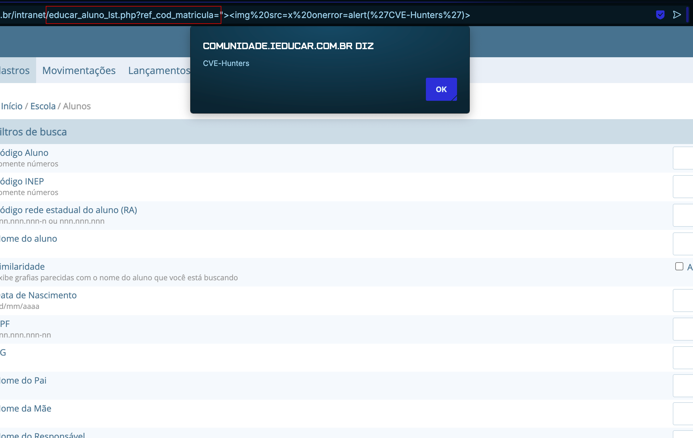

## CVE-2025-8346: Cross-Site Scripting (XSS) Reflected endpoint `educar_aluno_lst.php` via `ref_cod_matricula` parameter

> ***CVE Publication: https://www.cve.org/CVERecord?id=CVE-2025-8346***

## Summary

<p style="text-align: justify;">A Reflected Cross-Site Scripting (XSS) vulnerability was identified in the <code>educar_aluno_lst.php</code> endpoint of the i-Educar application. This vulnerability allows attackers to inject malicious scripts into the <code>ref_cod_matricula</code> parameter.</p>

## Details

Vulnerable Endpoint: `educar_aluno_lst.php`

Parameter: `ref_cod_matricula`

## PoC

### Payload:

```javascript
  ">
```



### Full Payload:

```html
  https://localhost/intranet/educar_aluno_lst.php?ref_cod_matricula=">
```

## Impact

<p style="text-align: justify;">
  <ul>
    <li>Stealing session cookies: Attackers can use stolen session cookies to hijack a user's session and perform actions on their behalf.</li>
    <li>Downloading malware: Attackers can trick users into downloading and installing malware on their computers.</li>
    <li>Hijacking browsers: Attackers can hijack a user's browser or deliver browser-based exploits.</li>
    <li>Stealing credentials: Attackers can steal a user's credentials.</li>
    <li>Obtaining sensitive information: Attackers can obtain sensitive information stored in a user's account or in their browser.</li>
    <li>Defacing websites: Attackers can deface a website by altering its content.</li>
    <li>Misdirecting users: Attackers can change the instructions given to users who visit the target website, misdirecting their behavior.</li>
    <li>Damaging a business's reputation: Attackers can damage a business's image or spread misinformation by defacing a corporate website.</li>
  </ul>
</p>

## Reference

[https://github.com/CVE-Hunters/CVE/blob/main/i-educar/CVE-2025-8346.md](https://github.com/CVE-Hunters/CVE/blob/main/i-educar/CVE-2025-8346.md)

## Finder

[](https://www.linkedin.com/in/nmmorette/) [Natan Maia Morette](https://www.linkedin.com/in/nmmorette/)

> ***By: [CVE-Hunters](https://github.com/CVE-Hunters/cve-hunters)***