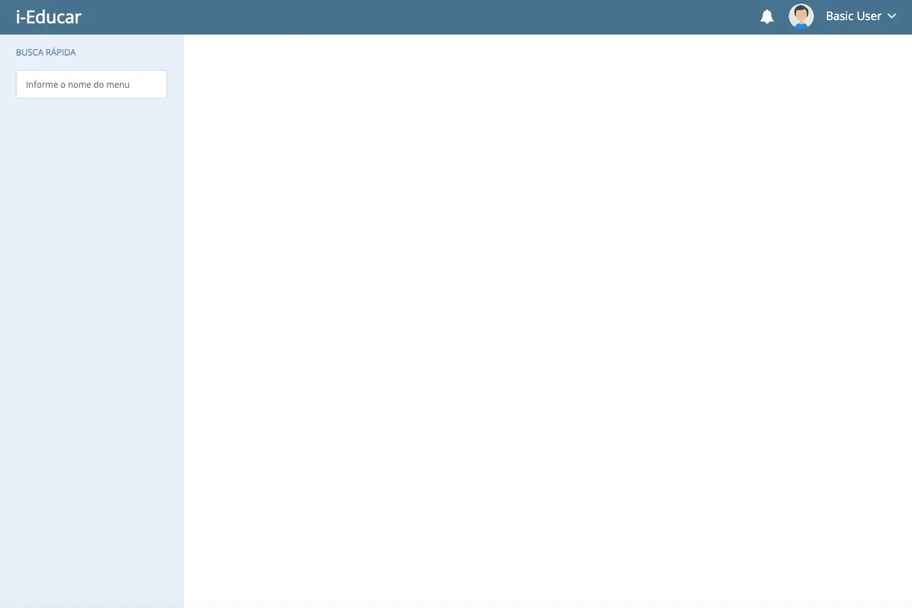
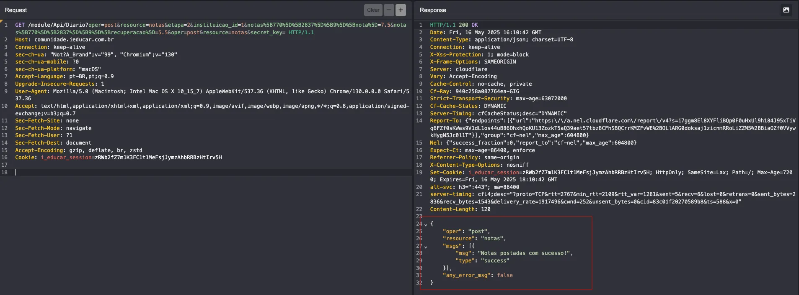

## CVE-2025-8789: Broken Function Level Authorization (BFLA) permite que usuários não autorizados alterem as notas dos alunos

> ***CVE Publication: https://www.cve.org/CVERecord?id=CVE-2025-8789***

## Resumo

<p style="text-align: justify;">Um endpoint de API no i-Educar 2.9.0 é vulnerável à Broken Function Level Authorization (BFLA). Um usuário não autorizado consegue modificar as notas dos alunos acessando diretamente o endpoint <code>/module/Api/Diario</code>, ignorando os controles de permissão. Isso leva a sérios problemas de integridade, em que qualquer pessoa com acesso ao formato da API pode adulterar registros acadêmicos.</p>

## Detalhes

<p style="text-align: justify;">O endpoint <code>/module/Api/Diario</code> não aplica verificações de autorização adequadas para validar se o usuário que efetuou a chamada tem o direito de alterar as notas dos alunos. Mesmo um usuário sem nenhum perfil ou permissões atribuídas pode enviar uma solicitação e alterar as notas dos alunos no sistema com sucesso. Não há validação de funções de sessão ou permissões associadas antes da execução de ações acadêmicas confidenciais.

## PoC

<p style="text-align: justify;"><ul><li>1 - Criar um novo usuário sem privilégios:</li></ul></p>



<p style="text-align: justify;"><ul><li>2 - Preparar uma solicitação para o endpoint <code>/module/Api/Diario</code> com os dados para enviar a nota de um aluno, usando o cookie de usuário com privilégios baixos e, em seguida, enviar a solicitação:</li></ul></p>



Resultado traduzido de pt-br para en:

```javascript
{
"oper": "post",
"resource": "grades",
"msgs": [{
"msg": "Notas publicadas com sucesso!",
"type": "success"
}],
"any_error_msg": false
}
```
## Impacto

<p style="text-align: justify;">Esta é uma vulnerabilidade de Autorização de Nível de Função Quebrada (BFLA), conforme categorizado pelo OWASP API Security Top 10 (2023) - API4. As consequências incluem:
<ul>
<li>Adulteração de dados acadêmicos sem autorização.</li>
<li>Perda da integridade dos dados em registros escolares.</li>
<li>Possíveis danos legais e à reputação de instituições educacionais.</li>
</ul>
</p>

## Referência

**[https://github.com/CVE-Hunters/CVE/blob/main/i-educar/CVE-2025-8789.md](https://github.com/CVE-Hunters/CVE/blob/main/i-educar/CVE-2025-8789.md)**

## Encontrado por:

[](https://www.linkedin.com/in/nmmorette/) [Natan Maia Morette](https://www.linkedin.com/in/nmmorette)

> ***Por: [CVE-Hunters](https://github.com/CVE-Hunters/cve-hunters)***