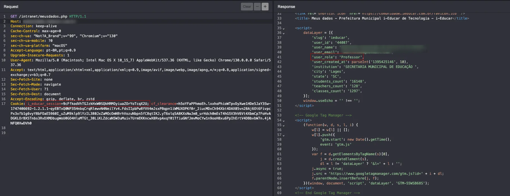
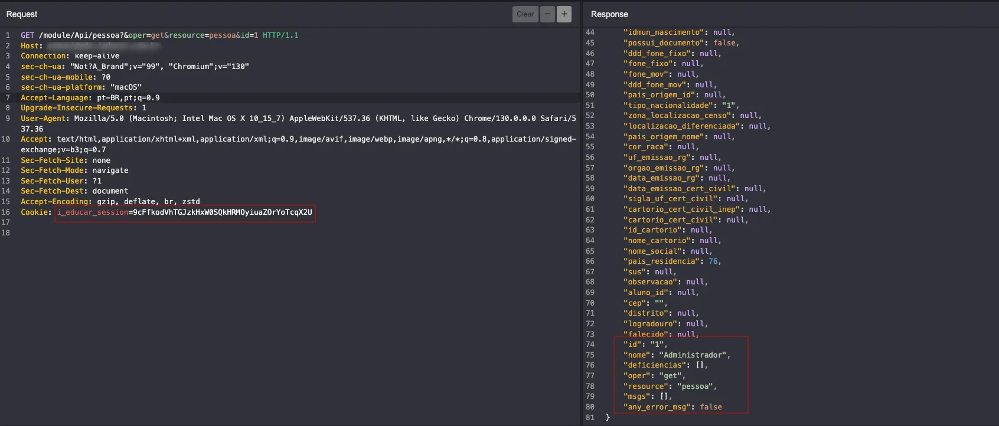
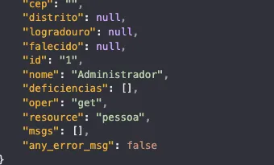

## CVE-2025-8790: Broken Object Level Authorization (BOLA) permite acesso não autorizado a dados de outros usuários

> ***CVE Publication: https://www.cve.org/CVERecord?id=CVE-2025-8790***

## Resumo

<p style="text-align: justify;">Uma vulnerabilidade de Broken Object Level Authorization (BOLA) foi identificada na API do i-educar 2.8 e 2.9, permitindo que qualquer usuário autenticado com privilégios baixos acesse informações confidenciais de outros usuários manipulando o parâmetro <code>id</code> no endpoint de recurso <code>pessoa</code>.</p>

## Detalhes

<p style="text-align: justify;">O endpoint <code>/module/Api/pessoa</code> não possui verificações de autorização adequadas para garantir que o usuário autenticado só consiga acessar seus próprios dados.</br></br>Ao alterar o parâmetro id na solicitação a seguir, qualquer usuário autenticado pode recuperar informações sobre outros usuários:</br></br><code>GET /module/Api/pessoa?&oper=get&resource=pessoa&id=1 HTTP/1.1</code></p>

## PoC

<p style="text-align: justify;"><ul><li>1. Autentique-se como um usuário sem privilégios (por exemplo, aluno, professor).</li></ul></p>



<p style="text-align: justify;"><ul><li>2. Envie a seguinte solicitação direcionada ao usuário id=1:</li></ul></p>

```terminal
GET /module/Api/pessoa?&oper=get&resource=pessoa&id=1 HTTP/1.1
Cookie: i_educar_session=VALID_SESSION_COOKIE }
```


<p style="text-align: justify;"><ul><li>3. Observe que os dados do usuário para id=1 são retornados, mesmo que o usuário logado não esteja autorizado a acessar esse perfil:</li></ul></p>



## Impacto

<p style="text-align: justify;">Esta vulnerabilidade é um problema de Broken Object Level Authorization (BOLA) (OWASP API Top 10 - 2023, A01), permitindo a exposição de dados confidenciais. Qualquer usuário autenticado pode acessar informações pessoais de outros usuários. Isso pode levar a:
<ul>
<li>Acesso não autorizado a PII confidenciais;</li>
<li>Violação das leis de proteção de dados (por exemplo, LGPD, GDPR);</li>
<li>Possível abuso de dados do usuário ou personificação;</li>
<li>Enumeração de usuários.</li>
</ul>
</p>

## Referência

**[https://github.com/CVE-Hunters/CVE/blob/main/i-educar/CVE-2025-8790.md](https://github.com/CVE-Hunters/CVE/blob/main/i-educar/CVE-2025-8790.md)**

## Encontrado por:

[](https://www.linkedin.com/in/nmmorette/) [Natan Maia Morette](https://www.linkedin.com/in/nmmorette)

> ***Por: [CVE-Hunters](https://github.com/CVE-Hunters/cve-hunters)***