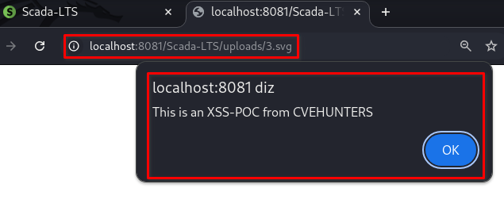

## CVE-2025-9145: Injeção de Cross-Site Scripting (XSS) armazenado por Upload de Arquivo SVG

> ***Publicação CVE: https://www.cve.org/CVERecord?id=CVE-2025-9145***

## Resumo

<p align="justify">Uma vulnerabilidade de Cross-Site Scripting (XSS) armazenado via desvio de upload de arquivo SVG foi identificada no endpoint <code>view_edit.shtm</code> do aplicativo Scada-LTS. Essa vulnerabilidade permite que invasores enviem arquivos maliciosos para o parâmetro <code>backgroundImageMP</code>. Os arquivos injetados são armazenados no servidor e executados automaticamente sempre que a página afetada é acessada por usuários, representando um risco significativo à segurança.</p>

## Detalhes

Endpoint Vulnerável: `view_edit.shtm`

Parâmetro: `backgroundImageMP`

<p align="justify">O aplicativo não consegue validar e sanitizar adequadamente as entradas do usuário no parâmetro <code>backgroundImageMP</code>. Essa falta de validação permite que invasores injetem scripts maliciosos, que são armazenados no servidor. Sempre que a página afetada é acessada, o payload malicioso é executado no navegador da vítima, potencialmente comprometendo os dados e o sistema do usuário.</p>

## PoC

<p align="justify">Salve o payload no arquivo <code>xss.svg</code>.</p>

<p align="justify">Após isso, acesse a página <code>views.shtm</code> e clique em <code>"computer +"</code> para adicionar uma nova <code>"view"</code>, clique no botão <code>"Escolher arquivo"</code> para escolher o arquivo malicioso, depois clique no botão <code>"Upload image"</code> para enviar o arquivo. Em seguida, clique no botão <code>"Save"</code>. Acesse o arquivo pela página de gatilho.</p>

### Payload:

````html
<svg xmlns=""http://www.w3.org/2000/svg"" fill=""none"">
  <script>
    alert(""This is an XSS-POC from CVEHUNTERS"");
  </script>
</svg>
````



## Impacto

<p style="text-align: justify;">
    <ul>
        <li>Roubo de cookies de sessão: Invasores podem usar cookies de sessão roubados para sequestrar a sessão de um usuário e executar ações em seu nome.</li>
        <li>Baixar malware: Invasores podem induzir os usuários a baixar e instalar malware em seus computadores.</li>
        <li>Sequestro de navegadores: Invasores podem sequestrar o navegador de um usuário ou aplicar exploits baseados nele.</li>
        <li>Roubo de credenciais: Invasores podem roubar as credenciais de um usuário.</li>
        <li>Obter informações confidenciais: Invasores podem obter informações confidenciais armazenadas na conta de um usuário ou em seu navegador.</li>
        <li>Desfigurar sites: Invasores podem desfigurar um site alterando seu conteúdo.</li>
        <li>Desorientar usuários: Invasores podem alterar as instruções fornecidas aos usuários que visitam o site alvo, desorientando seu comportamento.</li>
        <li>Prejudicar a reputação de uma empresa: Invasores podem prejudicar a imagem de uma empresa ou espalhar desinformação desfigurando um site corporativo.</li>
    </ul>
</p>

## Referência

***[https://github.com/KarinaGante/KGSec/blob/main/CVEs/Scada-LTS/CVE-2025-9145.md](https://github.com/KarinaGante/KGSec/blob/main/CVEs/Scada-LTS/CVE-2025-9145.md)***

## Encontrado por:

[](https://www.linkedin.com/in/karina-gante/) [Karina Gante](https://www.linkedin.com/in/karina-gante/)

> ***By: [CVE-Hunters](https://github.com/CVE-Hunters/cve-hunters)***