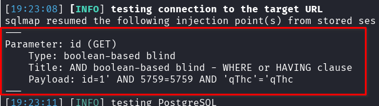
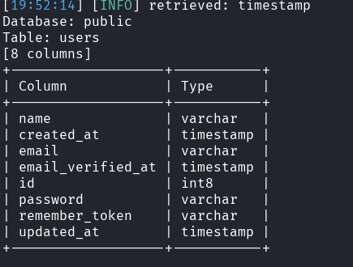

## CVE-2025-9532: Vulnerabilidade de Injeção SQL (Boolean-Based) no parâmetro `id` do Endpoint `RegraAvaliacao/view?id=[id]`

> *Publicação CVE: https://www.cve.org/CVERecord?id=CVE-2025-9532*

## Resumo

<p style="text-align: justify;">Uma vulnerabilidade de injeção SQL foi descoberta no parâmetro <code>id</code> do endpoint <code>RegraAvaliacao/view?id=[id]</code>. Esse problema permite que qualquer invasor não autenticado injete consultas SQL arbitrárias, potencialmente levando a acesso não autorizado aos dados ou exploração adicional, dependendo da configuração do banco de dados.</p>

## Detalhes

<p style="text-align: justify;">O aplicativo não consegue sanitizar adequadamente a entrada fornecida pelo usuário no parâmetro <code>id</code>. Como resultado, payloads SQL especialmente criados são interpretados diretamente pelo banco de dados de back-end.</p>

## PoC

Endpoint Vulnerável: `RegraAvaliacao/view?id=[id]`

Parâmetro: `id`

### Payload:

```terminal
sqlmap -u "http://localhost:8086/module/RegraAvaliacao/view?id=1" -p id --cookie="i_educar_session=qEk2wbjxS5IbECJGqnIa0dbmIyI3XIsXqm3WSh6K" \ --dbms=PostgreSQL --technique=B --dbs --batch
```





## Impacto

<p style="text-align: justify;">
  <ul>
    <li>Acesso não autorizado a dados confidenciais (por exemplo, usuários, senhas, registros).</li>
    <li>Enumeração de banco de dados (esquemas, tabelas, usuários, versões).</li>
    <li>Escalonamento para RCE dependendo da configuração do banco de dados (por exemplo, xp_cmdshell, UDFs).</li>
    <li>Comprometimento total do aplicativo se encadeado com outras vulnerabilidades.</li>
    <li>Esse problema afeta todos os usuários e ambientes, pois não requer autenticação e pode ser acessado por meio de um ponto de extremidade público.</li>
  </ul>
</p>

## Referência

***[https://github.com/KarinaGante/KGSec/blob/main/CVEs/i-educar/CVE-2025-9532.md](https://github.com/KarinaGante/KGSec/blob/main/CVEs/i-educar/CVE-2025-9532.md)***

## Encontrado por

[](https://www.linkedin.com/in/karina-gante/) [Karina Gante](https://www.linkedin.com/in/karina-gante/)

> ***By: [CVE-Hunters](https://github.com/CVE-Hunters/cve-hunters)***