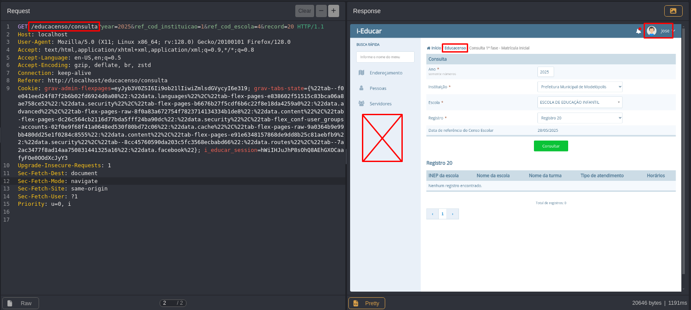

## CVE-2025-9609: Controle de acesso em nível de função ausente no endpoint `/educacenso/consulta`

> ***CVE Publication: https://www.cve.org/CVERecord?id=CVE-2025-9609***

## Resumo

<p style="text-align: justify;">Uma vulnerabilidade de Controle de Acesso Quebrado foi identificada no endpoint <code>/educacenso/consulta</code> do aplicativo i-Educar. Esse problema permite que usuários autenticados sem a função necessária acessem funcionalidades ou dados que deveriam ser restritos, resultando em elevação de privilégio e acesso não autorizado.</p>

## Detalhes

**Endpoint Vulnerável:** `GET /educacenso/consulta`

**Autenticação:** Obrigatória (mas verificações de autorização insuficientes)

**Função necessária:** Acesso somente ao aplicativo

**Cenário afetado:** Um usuário sem a função necessária ainda consegue acessar diretamente o endpoint.

<p style="text-align: justify;">O aplicativo não consegue aplicar o controle de acesso baseado em função (RBAC) adequado no endpoint <code>/educacenso/consulta</code>. Como resultado, usuários com níveis de privilégio mais baixos podem acessar dados e funcionalidades confidenciais que deveriam ser restritos a funções com privilégios mais altos.</p>

## PoC

Solicitação usando uma sessão de um usuário sem a função Educacenso:

```html
GET /educacenso/consulta HTTP/1.1 Host: <target> Cookie: PHPSESSID=<low_privileged_session>
```



**Resultado observado:** O servidor responde com HTTP 200 e retorna conteúdo restrito.

**Resultado esperado:** O servidor deve responder com HTTP 403 (Forbidden).

## Impacto

<p style="text-align: justify;">
<ul>
<li>Acesso não autorizado a dados confidenciais do censo educacional;</li>
<li>Elevação de privilégio de um usuário básico para funções com acesso a módulos restritos;</li>
<li>Possível manipulação de dados confidenciais se operações de gravação estiverem acessíveis;</li>
<li>Violação da confidencialidade e integridade de informações protegidas;</li>
<li>Violações de conformidade se dados pessoais confidenciais forem expostos a usuários não autorizados.</li>
</ul>
</p>

## Referência

***[https://github.com/marcelomulder/CVE/blob/main/i-educar/CVE-2025-9608.md](https://github.com/marcelomulder/CVE/blob/main/i-educar/CVE-2025-9608.md)***

## Encontrado por

[](http://www.linkedin.com/in/marceloqueirozjr) [Marcelo Queiroz](http://www.linkedin.com/in/marceloqueirozjr)

> ***Por: [CVE-Hunters](https://github.com/CVE-Hunters/cve-hunters)***