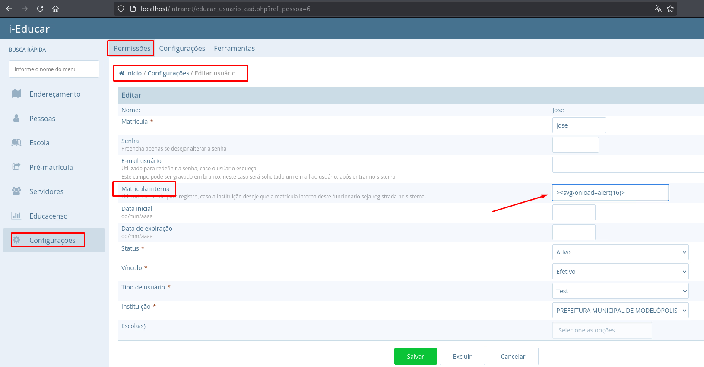
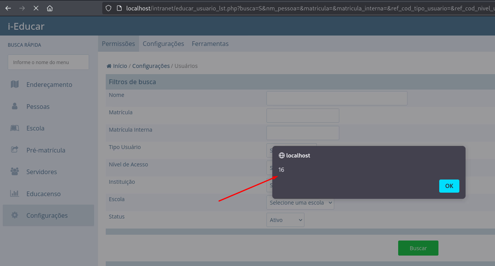

## CVE-2025-9638: Cross-Site Scripting (XSS) Stored in Admin Panel

> ***CVE Publication: https://www.cve.org/CVERecord?id=CVE-2025-9638***

## Summary

<p style="text-align: justify;">A Stored Cross-Site Scripting (XSS) vulnerability was identified in the <code>educar_usuario_cad.php</code> endpoint of the i-Educar application. The issue arises because the <code>matricula_interna</code> parameter is not sanitized before being stored in the database. Malicious scripts injected into this field persist in the system and are executed whenever the affected record is displayed in the web interface, leading to a persistent client-side compromise.</p>

## Details

Vulnerable Endpoint: `educar_usuario_cad.php`

Parameter: `matricula_interna`

## PoC

### Payload

```
><svg/onload=alert(16)>
```

### Steps to Reproduce:

<p style="text-align: justify;">
  <ul>
    <li>Log in with an account that can create or edit users.</li>
    <li>Navigate to Configurações → Permissões → Usuários.</li>
    <li>Create a new user or edit an existing one.</li>
    <li>In the Matrícula Interna field, insert the payload.</li>
    <li>Save changes.</li>
  </ul>
</p>



<p style="text-align: justify;">
  <ul>
    <li>Open the affected user record.</li>
    <li>The payload executes immediately, confirming the stored XSS.</li>
  </ul>
</p>



## Impact

<p style="text-align: justify;">
  <ul>
    <li>Session hijacking: Stealing cookies or authentication tokens to impersonate users.</li>
    <li>Credential theft: Harvesting usernames and passwords using malicious scripts.</li>
    <li>Malware delivery: Distributing unwanted or harmful code to victims.</li>
    <li>Privilege escalation: Compromising administrative users through persistent scripts.</li>
    <li>Data manipulation or defacement: Changing or disrupting site content.</li>
    <li>Reputation damage: Eroding trust among site users and administrators.</li>
  </ul>
</p>

## Reference

***[https://fluidattacks.com/pt/advisories/travis](https://fluidattacks.com/pt/advisories/travis)***

## Finder

[](http://www.linkedin.com/in/marceloqueirozjr) [Marcelo Queiroz](http://www.linkedin.com/in/marceloqueirozjr)

> ***By: [CVE-Hunters](https://github.com/CVE-Hunters/cve-hunters)***