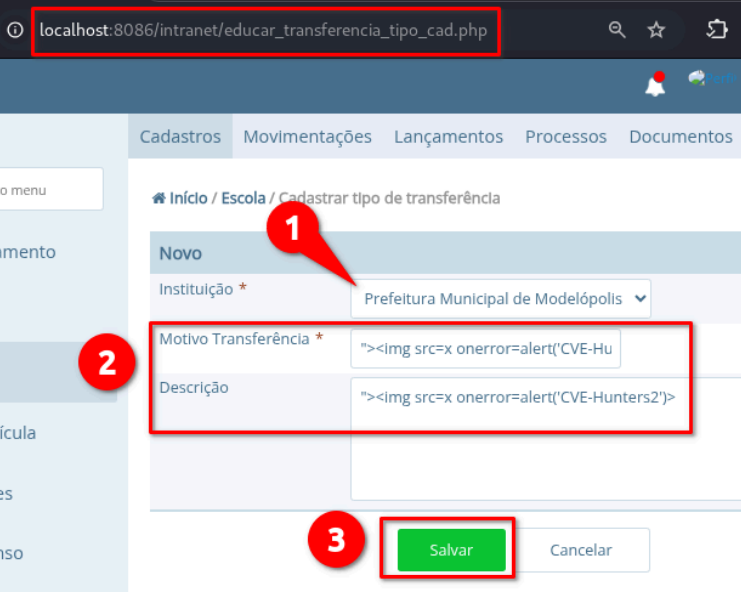
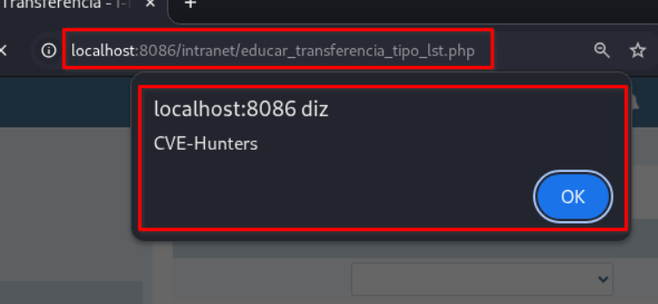
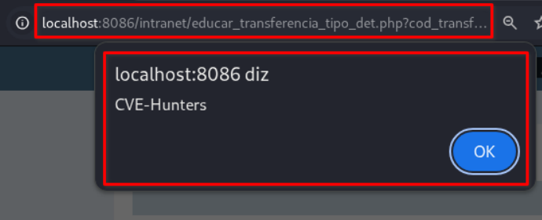
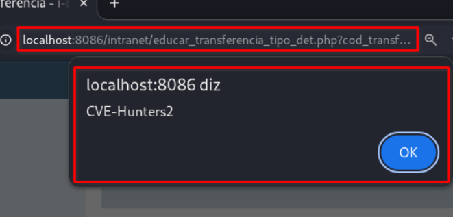

## CVE-2025-9652: Múltiplos Cross-Site Scripting (XSS) Armazenado no endpoint `educar_transferencia_tipo_cad.php`

> ***Publicação CVE: https://www.cve.org/CVERecord?id=CVE-2025-9652***

## Resumo

<p style="text-align: justify;">Múltiplas vulnerabilidades de XSS (Cross-Site Scripting Armazenado) foram identificadas no endpoint <code>educar_transferencia_tipo_cad.php</code> do aplicativo i-Educar. Essa vulnerabilidade permite que invasores injetem scripts maliciosos nos parâmetros <code>nm_tipo</code> e <code>desc_tipo</code>. Os scripts injetados são armazenados no servidor e executados automaticamente sempre que a página afetada é acessada pelos usuários, representando um risco de segurança significativo.</p>

## Detalhes

Endpoint Vulnerável: `/intranet/educar_transferencia_tipo_cad.php`

Parâmetros:`nm_tipo` e `desc_tipo`

Outro Endpoint Afetado: `/intranet/educar_transferencia_tipo_det.php?cod_transferencia_tipo=[id]`

<p style="text-align: justify;">O aplicativo não consegue validar e sanitizar adequadamente as entradas do usuário nos parâmetros <code>nm_tipo</code> e <code>desc_tipo</code>. Essa falta de validação permite que invasores injetem scripts maliciosos, que são armazenados no servidor. Sempre que a página afetada é acessada, o payload malicioso é executado no navegador da vítima, potencialmente comprometendo os dados e o sistema do usuário.</p>

## PoC

### Payload:

````html
">
````









## Impacto

<p style="text-align: justify;">
    <ul>
        <li>Roubo de cookies de sessão: Invasores podem usar cookies de sessão roubados para sequestrar a sessão de um usuário e executar ações em seu nome.</li>
        <li>Baixar malware: Invasores podem induzir os usuários a baixar e instalar malware em seus computadores.</li>
        <li>Sequestro de navegadores: Invasores podem sequestrar o navegador de um usuário ou aplicar exploits baseados nele.</li>
        <li>Roubo de credenciais: Invasores podem roubar as credenciais de um usuário.</li>
        <li>Obter informações confidenciais: Invasores podem obter informações confidenciais armazenadas na conta de um usuário ou em seu navegador.</li>
        <li>Desfigurar sites: Invasores podem desfigurar um site alterando seu conteúdo.</li>
        <li>Desorientar usuários: Invasores podem alterar as instruções fornecidas aos usuários que visitam o site alvo, desorientando seu comportamento.</li>
        <li>Prejudicar a reputação de uma empresa: Invasores podem prejudicar a imagem de uma empresa ou espalhar desinformação desfigurando um site corporativo.</li>
    </ul>
</p>

## Referência

***[https://github.com/KarinaGante/KGSec/blob/main/CVEs/i-educar/CVE-2025-9652.md](https://github.com/KarinaGante/KGSec/blob/main/CVEs/i-educar/CVE-2025-9652.md)***

## Encontrado por

[](https://www.linkedin.com/in/karina-gante/) [Karina Gante](https://www.linkedin.com/in/karina-gante/)

> ***By: [CVE-Hunters](https://github.com/CVE-Hunters/cve-hunters)***