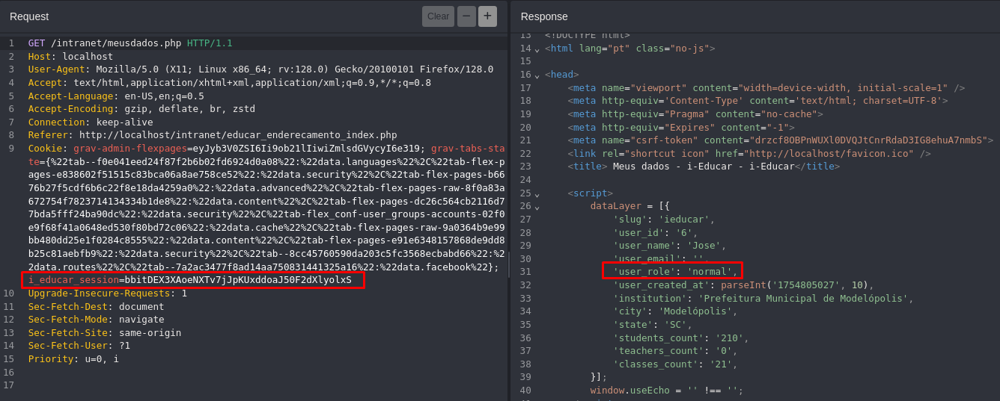
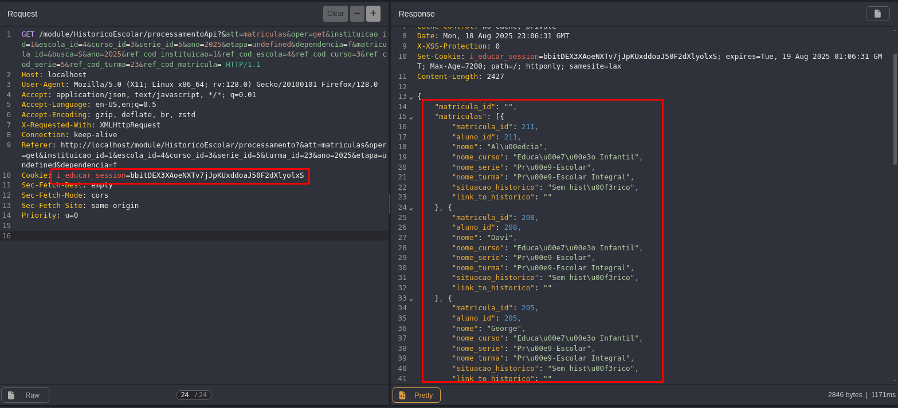

## CVE-2025-9687: Broken Object Level Authorization (BOLA) permite a enumeração de alunos via `/module/HistoricoEscolar/processamentoApi`

> ***CVE Publication: https://www.cve.org/CVERecord?id=CVE-2025-9687***

## Resumo

<p style="text-align: justify;">Uma vulnerabilidade de Broken Object Level Authorization (BOLA) foi identificada no endpoint <code>/module/HistoricoEscolar/processamentoApi</code> do aplicativo i-Educar.
Essa falha permite que usuários com poucos privilégios (por exemplo, contas padrão de alunos/responsáveis) recuperem informações de matrícula (<code>matrículas</code>) de alunos fora de seu escopo, expondo Informações Pessoais Identificáveis ​​(PII) sem as devidas verificações de autorização.</p>

## Detalhes

<p style="text-align: justify;"><b>Endpoint Vulnerável:</br></b><code>GET /module/HistoricoEscolar/processamentoApi</code></br></br>O aplicativo não consegue aplicar a <b>autorização em nível de objeto</b> ao manipular este endpoint. Como resultado, qualquer usuário autenticado pode manipular os valores da solicitação para acessar informações confidenciais (nomes, IDs, status de matrícula) dos alunos.</p>

## PoC

<p style="text-align: justify;"><ul><li>Autentique como um usuário sem privilégios (por exemplo, aluno, professor).</li></ul></p>



<p style="text-align: justify;"><ul><li>Envie a seguinte requisição:</li></ul></p>

```terminal
GET /module/HistoricoEscolar/processamentoApi?att=matriculas&oper=get&instituicao_id=1&escola_id=4&curso_id=3&serie_id=5&turma_id=23&ano=2025&busca=S HTTP/1.1
Cookie: i_educar_session=<low-privileged-session>
```


<p style="text-align: justify;"><ul><li>Pudemos observar que informações sobre os alunos foram retornadas.</li></ul></p>

## Impacto

<p style="text-align: justify;">Esta vulnerabilidade é um problema de Broken Object Level Authorization (BOLA) (OWASP API Top 10 - 2023, A01), permitindo a exposição de dados sensíveis. Qualquer usuário autenticado pode acessar informações pessoais de outros usuários. Isso pode levar a:
<ul>
<li>Acesso não autorizado a PII sensíveis;</li>
<li>Violação das leis de proteção de dados (por exemplo, LGPD, GDPR);</li>
<li>Possível abuso de dados do usuário ou personificação;</li>
<li>Enumeração de usuários.</li>
</ul>
</p>

## Referência

***[https://github.com/marcelomulder/CVE/blob/main/i-educar/CVE-2025-9687.md](https://github.com/marcelomulder/CVE/blob/main/i-educar/CVE-2025-9687.md)***

## Encontrado por

[](http://www.linkedin.com/in/marceloqueirozjr) [Marcelo Queiroz](http://www.linkedin.com/in/marceloqueirozjr)

> ***Por: [CVE-Hunters](https://github.com/CVE-Hunters/cve-hunters)***