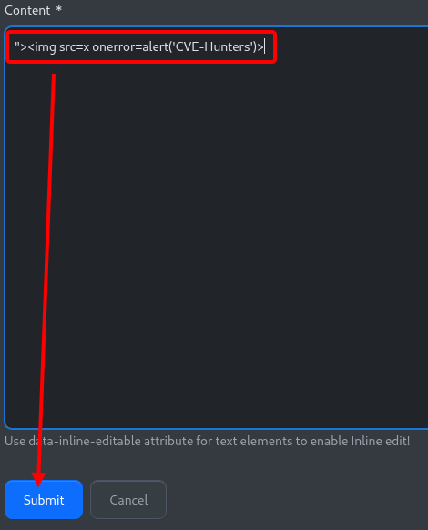
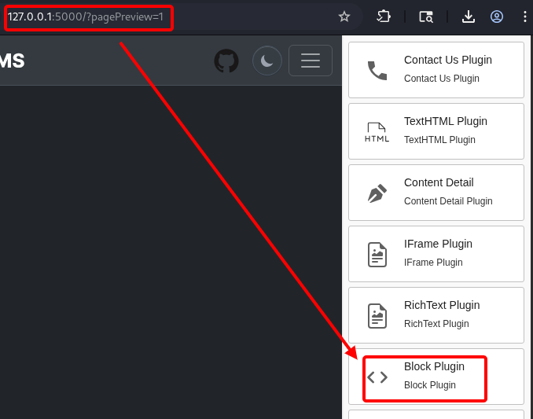
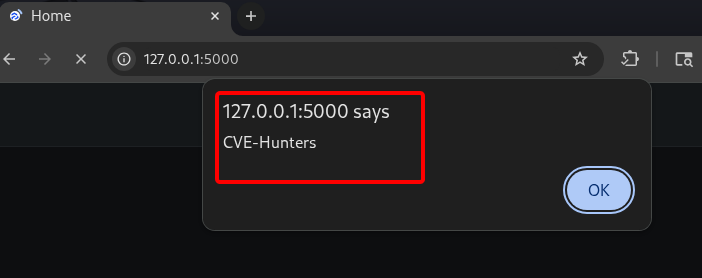

## CVE-2026-11434: Cross-Site Scripting (XSS) Armazenado no endpoint `/admin/blocks` via `Blocks Plugin`

> ***Publicação da CVE: https://www.cve.org/CVERecord?id=CVE-2026-11434***

## Resumo

<p style="text-align: justify;">Uma vulnerabilidade de Cross-Site Scripting (XSS) Armazenado foi identificada no endpoint <code>/admin/blocks</code> da aplicação FluentCMS. Essa vulnerabilidade permite que atacantes injetem scripts maliciosos por meio do <code>Blocks Plugin</code>. Os scripts injetados são armazenados no servidor e executados automaticamente sempre que a página principal é acessada pelos usuários, representando um risco significativo de segurança.</p>

## Detalhes

Endpoint vulnerável: `/admin/blocks`

Parâmetro: `Blocks Plugin`

## PoC

### Payload

```html
">
```

### Passos para Reproduzir:

<p style="text-align: justify;">Acesse o endpoint vulnerável e clique em <code>"Add Block"</code> para configurar uma nova entrada. Insira o payload no campo <code>"Content"</code>, digite qualquer informação nos outros campos e clique em <code>"Submit"</code>. Acesse as páginas de pré-visualização via <code>"/?pagePreview=1"</code>, arraste e solte o "Block Plugin" em qualquer lugar da página e selecione o bloco configurado anteriormente. Acesse a página principal e o script será executado automaticamente:</p>







## Impacto

<p style="text-align: justify;">
<ul>
<li>Sequestro de sessão: Roubo de cookies ou tokens de autenticação para se passar por usuários.</li>
<li>Roubo de credenciais: Coleta de nomes de usuário e senhas usando scripts maliciosos.</li>
<li>Distribuição de malware: Disseminação de código indesejado ou prejudicial para as vítimas.</li>
<li>Elevação de privilégios: Comprometimento de usuários administrativos por meio de scripts persistentes.</li>
<li>Manipulação de dados ou desfiguração (defacement): Alteração ou interrupção do conteúdo do site.</li>
<li>Dano à reputação: Erosão da confiança entre usuários e administradores do site.</li>
</ul>
</p>

## Referência

***[https://github.com/KarinaGante/KG-Sec/blob/main/CVEs/FluentCMS/CVE-2026-11434.md](https://github.com/KarinaGante/KG-Sec/blob/main/CVEs/FluentCMS/CVE-2026-11434.md)***

## Encontrado por

[](https://www.linkedin.com/in/karina-gante/) [Karina Gante](https://www.linkedin.com/in/karina-gante/)

> ***Por: [CVE-Hunters](https://github.com/CVE-Hunters/cve-hunters)***