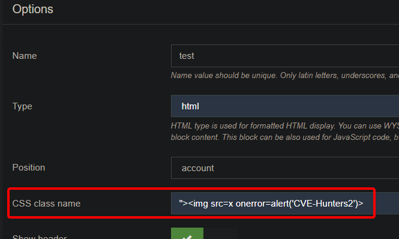
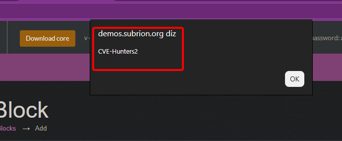

## CVE-2026-12202: Cross-Site Scripting (XSS) Armazenado no parâmetro `CSS class name` do endpoint `Blocks`

> ***Publicação da CVE: https://www.cve.org/CVERecord?id=CVE-2026-12202***

## Resumo

<p style="text-align: justify;">Uma vulnerabilidade de Cross-Site Scripting (XSS) Armazenado foi identificada no endpoint <code>Blocks</code> da aplicação Subrion CMS. Essa vulnerabilidade permite que atacantes injetem scripts maliciosos por meio do parâmetro <code>CSS class name</code>. Os scripts injetados são armazenados no servidor e executados automaticamente, representando um risco significativo de segurança.</p>

## Detalhes

Endpoint Vulnerável: `Blocks`

Parâmetro: `CSS class name`

## PoC

### Payload

```html
">
```

### Passos para Reprodução:

<p style="text-align: justify;">Acesse o painel administrativo e clique em <code>"Edit Blocks"</code>. Na página <code>"Blocks"</code>, clique no botão <code>"Add Block"</code> para configurar uma nova entrada. Insira o payload no campo <code>"CSS class name"</code>, digite qualquer conteúdo nos outros campos e clique em <code>"Add"</code>. O payload será ativado automaticamente:</p>





## Impacto

<p style="text-align: justify;">
<ul>
<li>Sequestro de sessão: Roubo de cookies ou tokens de autenticação para se passar por usuários.</li>
<li>Roubo de credenciais: Coleta de nomes de usuário e senhas usando scripts maliciosos.</li>
<li>Distribuição de malware: Disseminação de código indesejado ou prejudicial para as vítimas.</li>
<li>Elevação de privilégios: Comprometimento de usuários administrativos por meio de scripts persistentes.</li>
<li>Manipulação de dados ou desfiguração (defacement): Alteração ou interrupção do conteúdo do site.</li>
<li>Dano à reputação: Erosão da confiança entre usuários e administradores do site.</li>
</ul>
</p>

## Referência

***[https://github.com/KarinaGante/KG-Sec/blob/main/CVEs/SubrionCMS/CVE-2026-12202.md](https://github.com/KarinaGante/KG-Sec/blob/main/CVEs/SubrionCMS/CVE-2026-12202.md)***

## Encontrado por

[](https://www.linkedin.com/in/karina-gante/) [Karina Gante](https://www.linkedin.com/in/karina-gante/)

> ***Por: [CVE-Hunters](https://github.com/CVE-Hunters/cve-hunters)***
