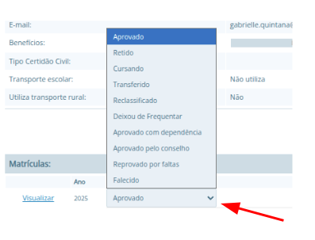
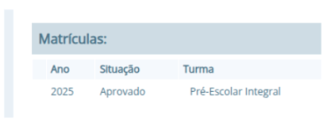
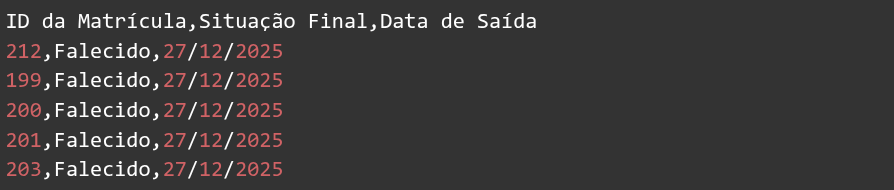
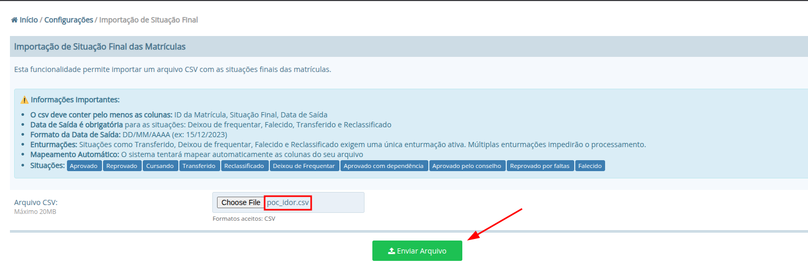
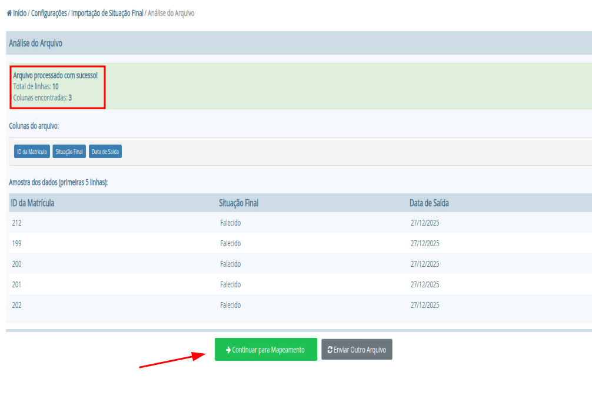
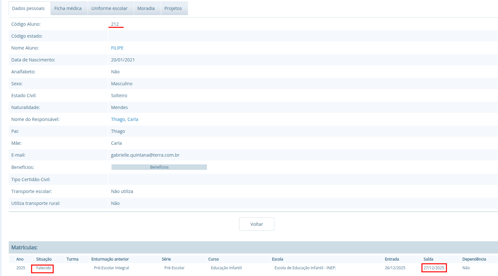
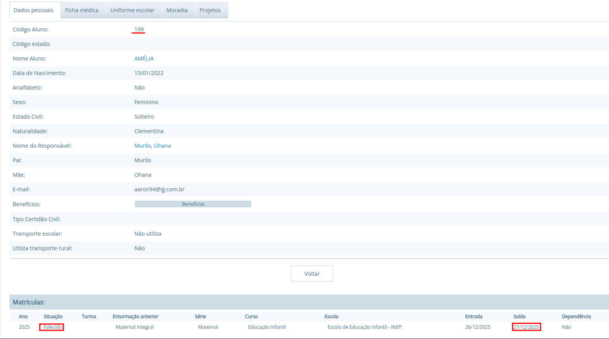

## CVE-2026-2015: Broken Function Level Authorization (BFLA) allows arbitrary modification of `Student Records` via `Final Status Import` tool

> *CVE Publication: https://www.cve.org/CVERecord?id=CVE-2026-2015*

## Summary

A Broken Function Level Authorization (BFLA) vulnerability was identified in the <code>Final Status Import</code> tool of the i-Educar application. This flaw allows an authenticated user with <code>"School"</code> level permissions to bypass intended functional restrictions and modify academic records belonging to any school unit within the municipal network.

## Details

Vulnerable Component: `Configurations > Tools > Final Status Import`

## PoC

### Context:

The attacker account is strictly limited to a specific school unit (Elementary School) with <code>low-level</code> "School" permissions. All administrative or global editing permissions are disabled.

#### Authorized Access: 

When an administrative user (with global or proper local permissions) accesses a student's record, the "Final Status" dropdown is visible and fully functional, allowing manual status updates.

#### Unauthorized Access (Attacker View): 

When the attacker attempts to edit a student from a different school unit via the standard UI, the "Final Status" dropdown is hidden. The system correctly identifies that the user lacks the authority for this specific function in the frontend.

### Payload:

The attacker identifies student IDs from other institutions (e.g., IDs 212, 199, 200). A CSV payload is prepared to force a status change to "Falecido" (Deceased).

### Steps to Reproduce:

The attacker navigates to the Final Status Import tool. By uploading the CSV, they trigger the vulnerable service. The backend processes the IDs without validating institutional ownership.

The tool reports success for all records. A check on the target student's profile (from the unauthorized unit) confirms the status has been changed. Multiple students are affected, proving the mass-sabotage capability.

## Impact

This is a Broken Function Level Authorization (BFLA) vulnerability, as categorized by OWASP API Security Top 10 (2023) - API4. The consequences include:
  <ul>
    <li>Tampering with academic data without authorization.</li>
    <li>Loss of data integrity in school records.</li>
    <li>Potential legal and reputational damage for educational institutions.</li>
  </ul>

## Reference

***[https://github.com/ViniCastro2001/Security_Reports/blob/main/i-educar/BFLA-Final-Status-Import/README.md](https://github.com/ViniCastro2001/Security_Reports/blob/main/i-educar/BFLA-Final-Status-Import/README.md)***

## Finder

 [Vinicius Castro](http://www.linkedin.com/in/vinicius-gross-castro)

> ***By: [CVE-Hunters](https://github.com/CVE-Hunters/cve-hunters)***