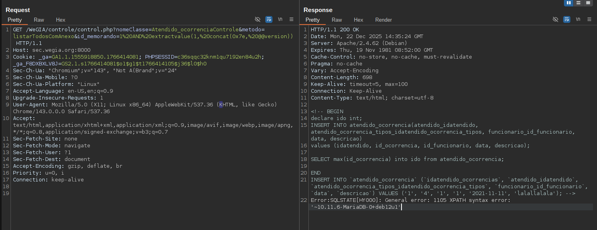
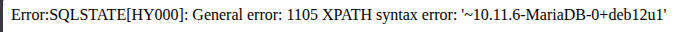

## CVE-2026-23723: SQL Injection (Error-Based) Vulnerability in `id_memorando` Parameter on `Atendido_ocorrenciaControle` Endpoint

> *CVE Publication: https://www.cve.org/CVERecord?id=CVE-2026-23723*

## Summary

<p style="text-align: justify;">An authenticated SQL Injection vulnerability was identified in the <code>Atendido_ocorrenciaControle</code> endpoint via the <code>id_memorando</code> parameter. This flaw allows for full database exfiltration, exposure of sensitive PII, and potential arbitrary file reads in misconfigured environments.</p>

## Details

Vulnerable Endpoint: `Atendido_ocorrenciaControle`

Parameter: `id_memorando`

## PoC

### Payload:

```html
1 AND extractvalue(1, concat(0x7e, @@Version))
```

#### Example url:

```html
https://sec.wegia.org:8000/WeGIA/controle/control.php?nomeClasse=Atendido_ocorrenciaControle&metodo=listarTodosComAnexo&id_memorando=1%20AND%20extractvalue(1,%20concat(0x7e,%20@@version))
```

### Steps to Reproduce:

<p style="text-align: justify;">
  <ul>
    <li>Login to the WeGIA system (user:admin, password: wegia) and obtain a valid session cookie.</li>
    <li>The vulnerability was confirmed on the official security testing server: <code>sec.wegia.org:8000</code>.</li>
    <li>Send a GET request to the vulnerable endpoint with the following payload:</li>
  </ul>
</p>




<p style="text-align: justify;">
  <ul>
    <li>Observe that the system returns a error message, confirming the injection:</li>
  </ul>
</p>



## Impact

<p style="text-align: justify;">
  <ul>
    <li>Unauthorized access to sensitive data (e.g., users, passwords, logs).</li>
    <li>Database enumeration (schemas, tables, users, versions).</li>
    <li>Escalation to RCE depending on DB configuration (e.g., xp_cmdshell, UDFs).</li>
    <li>Full compromise of the application if chained with other vulnerabilities.</li>
    <li>This issue affects all users and environments, as it does not require authentication and is reachable via a public endpoint.</li>
  </ul>
</p>

## Reference

***[https://github.com/LabRedesCefetRJ/WeGIA/security/advisories/GHSA-xfmp-2hf9-gfjp](https://github.com/LabRedesCefetRJ/WeGIA/security/advisories/GHSA-xfmp-2hf9-gfjp)***

## Finder

[](http://www.linkedin.com/in/vinicius-gross-castro) [Vinicius Castro](http://www.linkedin.com/in/vinicius-gross-castro)

> ***By: [CVE-Hunters](https://github.com/CVE-Hunters/cve-hunters)***