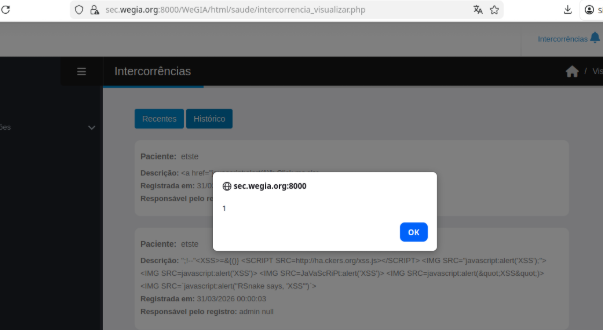

## CVE-2026-40282: Cross-Site Scripting (XSS) armazenado em Novo da função `intercorrencia_visualizar.php`

> ***Publicação CVE: https://www.cve.org/CVERecord?id=CVE-2026-40282***

## Resumo

<p style="text-align: justify;">Uma vulnerabilidade de Cross-Site Scripting (XSS) armazenada permite que um usuário autenticado injete JavaScript malicioso na página de notificações do Intercorrências, o qual é executado quando o usuário acessa a página, possibilitando o sequestro de sessão e a tomada de controle da conta.</p>

## Detalhes

<p style="text-align: justify;">O aplicativo não higieniza ou codifica corretamente o campo de nome de usuário, que é exibido em notificações do sistema e aceita entrada controlada pelo usuário. Um atacante pode injetar HTML ou JavaScript malicioso neste campo ao criar ou modificar um usuário.</br>Quando uma “intercorrência” é registrada, uma notificação é gerada. Ao clicar nesta notificação, o aplicativo renderiza o nome de usuário na interface sem o devido escape, fazendo com que qualquer código injetado seja executado no navegador.</br>Este comportamento demonstra codificação de saída inadequada, resultando em uma vulnerabilidade de XSS armazenado.</p>

- Endpoint vulnerável: `intercorrencia_visualizar.php`

## PoC

### Payload

```html

```

### Passos para reproduzir:

<p style="text-align: justify;"><b>1.</b> Cadastre um paciente onde o campo "Nome" ou "Sobrenome" contenha o payload.</br></br><b>2.</b> Adicione uma entrada de "Intercorrência" para este usuário.</br></br><b>3.</b> Navegue até a página de notificações "Intercorrências" e clique em "Recentes" e "Histórico". Esta vulnerabilidade afeta ambas as páginas.</br></br><b>4.</b> Observe que o payload é executado no navegador:</p>



## Impacto

<p style="text-align: justify;">

<ul>

<li>Sequestro de sessão: Roubo de cookies ou tokens de autenticação para se passar por outros usuários.</li>

<li>Roubo de credenciais: Coleta de nomes de usuário e senhas usando scripts maliciosos.</li>

<li>Distribuição de malware: Distribuição de código indesejado ou prejudicial às vítimas.</li>

<li>Elevação de privilégios: Comprometimento de usuários administrativos por meio de scripts persistentes.</li>

<li>Manipulação ou adulteração de dados: Alteração ou interrupção do conteúdo do site.</li>

<li>Danos à reputação: Erosão da confiança entre usuários e administradores do site.</li>

</ul>
</p>

## Referência

***[https://github.com/LabRedesCefetRJ/WeGIA/security/advisories/GHSA-r6h8-7vxv-q8pp](https://github.com/LabRedesCefetRJ/WeGIA/security/advisories/GHSA-r6h8-7vxv-q8pp)***

## Encontrado por

[](https://br.linkedin.com/in/thiagoescarrone) [Thiago Escarrone](https://br.linkedin.com/in/thiagoescarrone)

> ***Por: [CVE-Hunters](https://github.com/CVE-Hunters/cve-hunters)***

> ***By: [CVE-Hunters](https://github.com/CVE-Hunters/cve-hunters)***