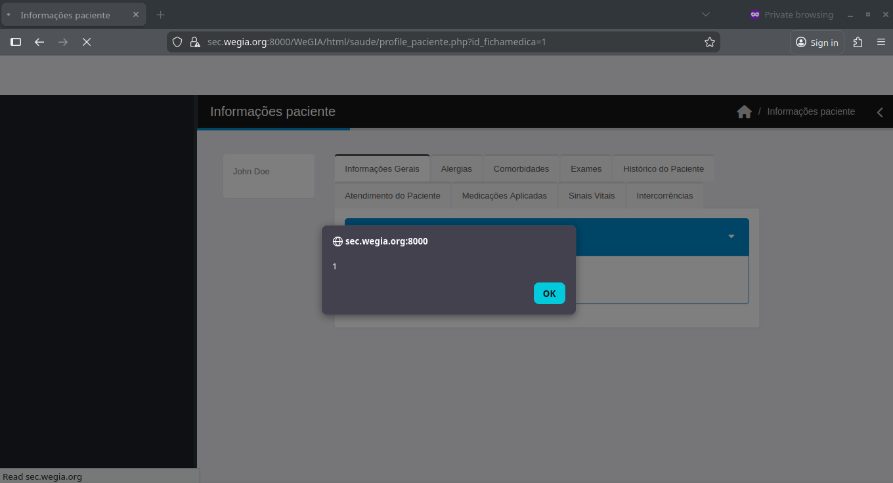

## CVE-2026-40283: Cross-Site Scripting (XSS) Stored in `profile_paciente.php`

> ***CVE Publication: https://www.cve.org/CVERecord?id=CVE-2026-40283***

## Summary

<p style="text-align: justify;">A Stored Cross-Site Scripting (XSS) vulnerability allows an authenticated user to inject malicious JavaScript via the “Nome” field in the “Informações Pacientes” page. The payload is stored and executed when the patient information is viewed.</p>

## Details

<p style="text-align: justify;">The application does not properly sanitize or encode the “Nome” field, which accepts user-controlled input. An attacker can insert malicious HTML or JavaScript into this field when creating or editing a patient.</br></br>When the “Informações Pacientes” page is accessed, this value is rendered in the DOM without proper escaping, leading to execution of the injected code in the browser.</br></br>This behavior indicates improper output encoding and results in a Stored XSS vulnerability.</p>

- Vulnerable Endpoint: `profile_paciente.php`

## PoC

### Payload

```html
<h1> <script>alert(1); </script></h1>
```

### Steps to Reproduce:

<p style="text-align: justify;"><b>1.</b> Register a patient where the “Name” field contains the payload.</br></br><b>2.</b> Navigate to the “Patient Information” page for the created patient.</br></br><b>3.</b> Observe that the payload is executed in the browser:</p>



## Impact

<p style="text-align: justify;">
  <ul>
    <li>Session hijacking: Stealing cookies or authentication tokens to impersonate users.</li>
    <li>Credential theft: Harvesting usernames and passwords using malicious scripts.</li>
    <li>Malware delivery: Distributing unwanted or harmful code to victims.</li>
    <li>Privilege escalation: Compromising administrative users through persistent scripts.</li>
    <li>Data manipulation or defacement: Changing or disrupting site content.</li>
    <li>Reputation damage: Eroding trust among site users and administrators.</li>
  </ul>
</p>

## Reference

***[https://github.com/LabRedesCefetRJ/WeGIA/security/advisories/GHSA-x74c-gwj9-6cwr](https://github.com/LabRedesCefetRJ/WeGIA/security/advisories/GHSA-x74c-gwj9-6cwr)***

## Finder

[](https://br.linkedin.com/in/thiagoescarrone) [Thiago Escarrone](https://br.linkedin.com/in/thiagoescarrone)

> ***By: [CVE-Hunters](https://github.com/CVE-Hunters/cve-hunters)***