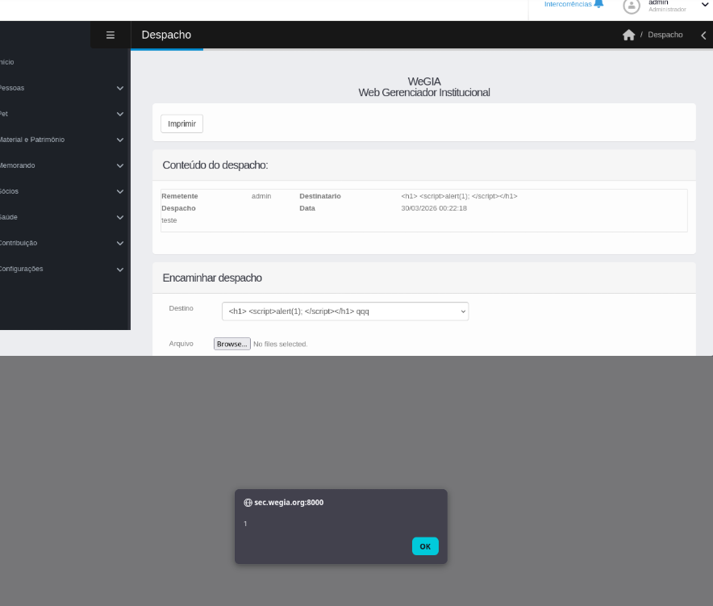

## CVE-2026-40284: Cross-Site Scripting (XSS) Stored in `listar_despachos.php`

> ***CVE Publication: https://www.cve.org/CVERecord?id=CVE-2026-40284***

## Summary

<p style="text-align: justify;">A Stored Cross-Site Scripting (XSS) vulnerability allows an authenticated user to inject malicious JavaScript via the “Destinatário” field. The payload is stored and later executed when viewing the dispatch page, impacting other users.</p>

## Details

<p style="text-align: justify;">The application fails to properly sanitize or escape the “Destinatário” field, which is populated with user-controlled data (nome do usuário). When a despacho is created using a maliciously crafted name containing HTML/JavaScript, this value is stored in the system.</br></br>During the rendering of the dispatch listing page, the application inserts this data into the DOM using .html(), causing the browser to interpret and execute the injected code.</br></br>This results in a Stored XSS vulnerability due to improper output encoding of user-controlled data.</p>

- Vulnerable Endpoint: `listar_despachos.php`

## PoC

### Payload

```html
<h1> <script>alert(1); </script></h1>
```

### Steps to Reproduce:

<p style="text-align: justify;"><b>1.</b> Alter the name of a user (or create one) with the payload.</br></br><b>2.</b> Create a despacho selecting this user as “Destinatário”.</br></br><b>3.</b> Access the page that lists or displays the despacho.</br></br><b>4.</b> Observe that the payload is executed in the browser:</p>



## Impact

<p style="text-align: justify;">
  <ul>
    <li>Session hijacking: Stealing cookies or authentication tokens to impersonate users.</li>
    <li>Credential theft: Harvesting usernames and passwords using malicious scripts.</li>
    <li>Malware delivery: Distributing unwanted or harmful code to victims.</li>
    <li>Privilege escalation: Compromising administrative users through persistent scripts.</li>
    <li>Data manipulation or defacement: Changing or disrupting site content.</li>
    <li>Reputation damage: Eroding trust among site users and administrators.</li>
  </ul>
</p>

## Reference

***[https://github.com/LabRedesCefetRJ/WeGIA/security/advisories/GHSA-mccp-8446-phw5](https://github.com/LabRedesCefetRJ/WeGIA/security/advisories/GHSA-mccp-8446-phw5)***

## Finder

[](https://br.linkedin.com/in/thiagoescarrone) [Thiago Escarrone](https://br.linkedin.com/in/thiagoescarrone)

> ***By: [CVE-Hunters](https://github.com/CVE-Hunters/cve-hunters)***