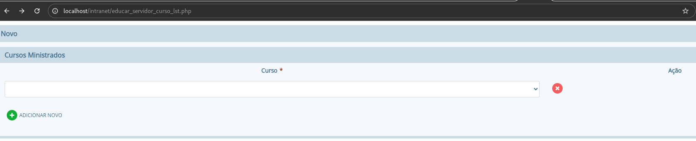
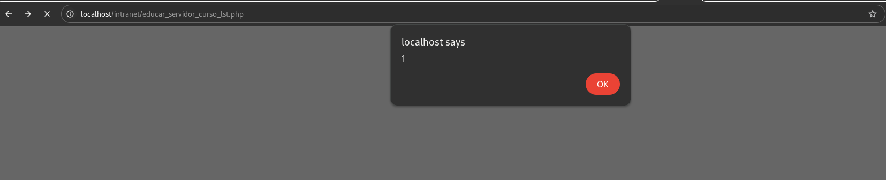

## CVE-2026-4355: Cross-Site Scripting (XSS) armazenado em Novo da função `educar_servidor_curso_lst` parâmetro `name`

> ***Publicação CVE: https://www.cve.org/CVERecord?id=CVE-2026-4355***

##Resumo

<p style="text-align: justify;">Uma vulnerabilidade de Cross-Site Scripting (XSS) armazenada foi identificada no endpoint <code>educar_servidor_curso_lst.php</code> do aplicativo I-educar 2.11. Essa vulnerabilidade permite que atacantes injetem scripts maliciosos no parâmetro <code>name</code>. Os scripts injetados são armazenados no servidor e executados automaticamente sempre que a página `<code>CurricularComponent/view</code>` é acessada pelos usuários, representando um risco de segurança significativo.

##Detalhes

Endpoint vulnerável: `educar_servidor_curso_lst.php`

Parâmetro: `name`

## PoC

### Payload

```
<script>alert(1)</script>
```

### Passos para executar:

<p style="text-align: justify;"> Registre o payload no campo `<code>name</code>` no endpoint `<code>educar_servidor_curso_lst.php</code>`.



<p style="text-align: justify;"> Depois disso, o XSS pode ser acionado abrindo o endpoint `<code>educar_servidor_curso_lst.php</code>` correspondente ao nome editado. ID.</p>



## Impacto

<p style="text-align: justify;">

<ul>

<li>Sequestro de sessão: Roubo de cookies ou tokens de autenticação para se passar por outros usuários.</li>

<li>Roubo de credenciais: Coleta de nomes de usuário e senhas usando scripts maliciosos.</li>

<li>Distribuição de malware: Distribuição de código indesejado ou prejudicial às vítimas.</li>

<li>Elevação de privilégios: Comprometimento de usuários administrativos por meio de scripts persistentes.</li>

<li>Manipulação ou adulteração de dados: Alteração ou interrupção do conteúdo do site.</li>

<li>Danos à reputação: Erosão da confiança entre usuários e administradores do site.</li>

</ul>
</p>

## Referência

***[https://github.com/Saiipe/CVE/blob/main/i-educar%2FCVE-2026-4355.md](https://github.com/Saiipe/CVE/blob/main/i-educar%2FCVE-2026-4355.md)***

## Encontrado por

[](http://www.linkedin.com/in/itauan) [Itauan Santos](http://www.linkedin.com/in/itauan)

> ***Por: [CVE-Hunters](https://github.com/CVE-Hunters/cve-hunters)***

> ***By: [CVE-Hunters](https://github.com/CVE-Hunters/cve-hunters)***