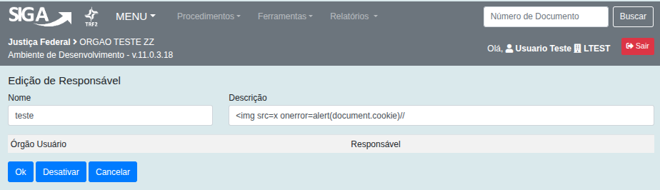
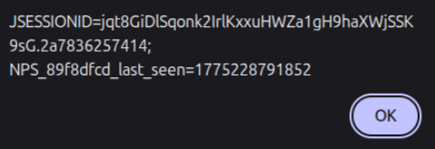

## CVE-2026-6990: Cross-Site Scripting (XSS) armazenado em Novo da função `/sigawf/app/responsavel/novo` parâmetro `Descrição`

> ***Publicação CVE: https://www.cve.org/CVERecord?id=CVE-2026-6990***

##Resumo

<p style="text-align: justify;">Uma vulnerabilidade de Cross-Site Scripting (XSS) armazenada foi identificada no endpoint <code>/sigawf/app/responsavel/novo</code> do aplicativo SIGA. Essa vulnerabilidade permite que atacantes injetem scripts maliciosos no parâmetro <code>Descrição</code>. Os scripts injetados são armazenados no servidor e executados automaticamente sempre que a página <code>/sigawf/app/responsavel/listar</code> é acessada pelos usuários, representando um risco de segurança significativo.</p>

## Detalhes

Endpoint vulnerável: `/sigawf/app/responsavel/novo`

Parâmetro: `Descrição`

## PoC

### Payload

```html
 Registre o payload no campo <code>Descrição</code> no endpoint <code>/sigawf/app/responsavel/novo</code>.



<p style="text-align: justify;"> Depois disso, o XSS pode ser acionado abrindo o endpoint <code>/sigawf/app/responsavel/listar</code>.</p>



## Impacto

<p style="text-align: justify;">

<ul>

<li>Sequestro de sessão: Roubo de cookies ou tokens de autenticação para se passar por outros usuários.</li>

<li>Roubo de credenciais: Coleta de nomes de usuário e senhas usando scripts maliciosos.</li>

<li>Distribuição de malware: Distribuição de código indesejado ou prejudicial às vítimas.</li>

<li>Elevação de privilégios: Comprometimento de usuários administrativos por meio de scripts persistentes.</li>

<li>Manipulação ou adulteração de dados: Alteração ou interrupção do conteúdo do site.</li>

<li>Danos à reputação: Erosão da confiança entre usuários e administradores do site.</li>

</ul>
</p>

## Referência

***[https://github.com/ViniCastro2001/Security_Reports/tree/main/siga/Stored-XSS-Responsavel](https://github.com/ViniCastro2001/Security_Reports/tree/main/siga/Stored-XSS-Responsavel)***

## Encontrado por

[](http://www.linkedin.com/in/vinicius-gross-castro) [Vinicius Castro](http://www.linkedin.com/in/vinicius-gross-castro)

> ***Por: [CVE-Hunters](https://github.com/CVE-Hunters/cve-hunters)***
