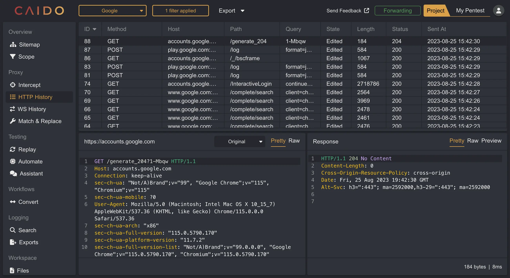
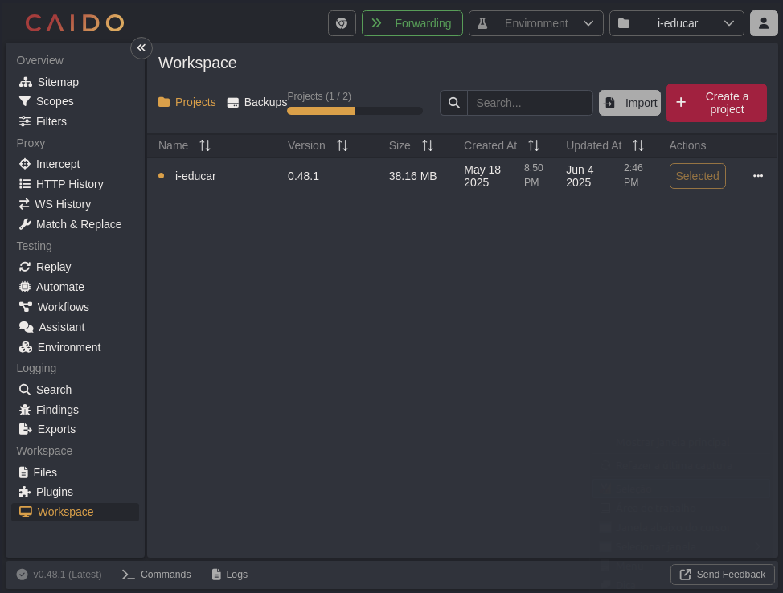
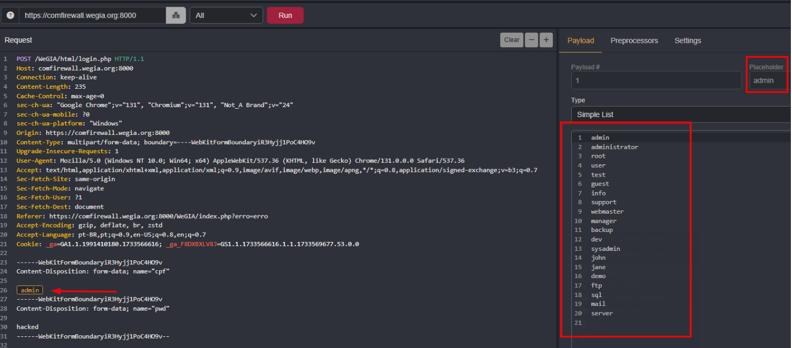
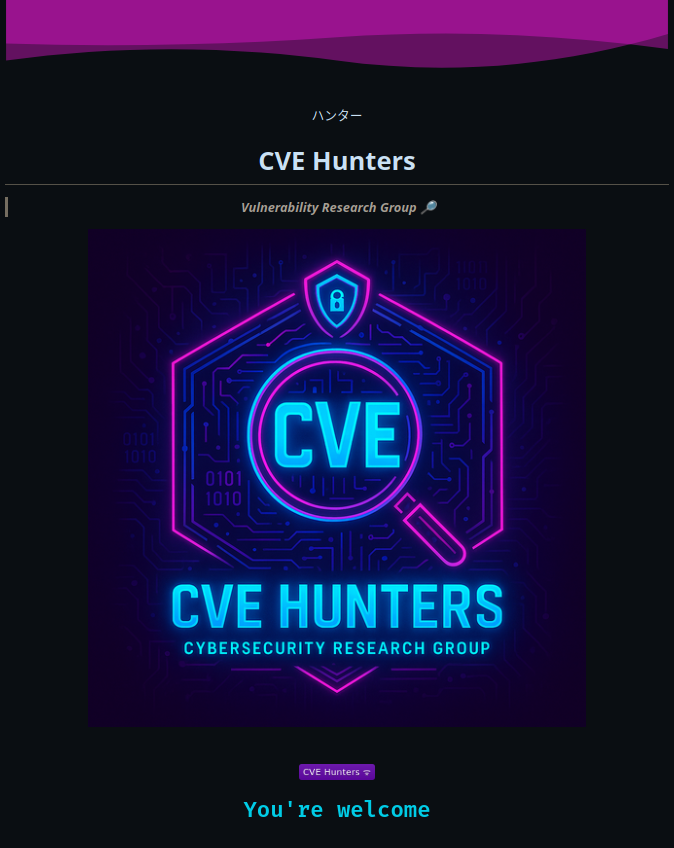

##  Contributions from the CVE-Hunters Group using Caido

Information security is a critical pillar in the development, deployment, and long-term maintenance of digital systems, especially those that serve public, nonprofit, or educational sectors. In an era of growing cyber threats and data breaches, strengthening the cybersecurity of open-source projects has never been more urgent.

Our research group, CVE-Hunters, is dedicated to identifying, analyzing, and responsibly disclosing vulnerabilities (CVEs) in widely used open-source software. We contribute to the global cybersecurity community by publishing CVEs, improving code security, and helping maintainers patch real-world security risks before they can be exploited.

By engaging in hands-on vulnerability research and real-world penetration testing, our initiative not only protects critical web applications but also provides practical training for the next generation of ethical hackers and cybersecurity professionals. We aim to foster a culture of proactive, collaborative, and accessible cybersecurity—empowering students and researchers to use advanced tools like Caido to simulate attacks, automate security testing, and contribute to secure development practices.

## Project Objectives

Our cybersecurity research is guided by three core pillars that align with both technical excellence and social responsibility:

  <ul>
    <li>Enhancing the security of popular open-source software by identifying, validating, and helping remediate real-world vulnerabilities. These flaws—ranging from Cross-Site Scripting (XSS) to Insecure Direct Object References (IDOR) and broken authentication—could be exploited in production environments, putting sensitive data at risk.</li>
    <li>Delivering hands-on cybersecurity training for aspiring professionals through real-life vulnerability assessment projects. Participants gain practical experience in bug discovery, secure code analysis, and responsible vulnerability disclosure using modern security testing tools like Caido, Burp Suite, and custom automation scripts.</li>
    <li>Encouraging collaborative research and the responsible publication of CVEs (Common Vulnerabilities and Exposures) to raise awareness of emerging threats, increase transparency, and support the continuous hardening of critical systems.</li>
  </ul>

## Case 1: WeGIA Platform

One of the main targets of our security research was the WeGIA (Web Manager for Assistance Institutions) platform — an open-source web application designed to manage third-sector organizations in Brazil, including NGOs, social shelters, and nonprofit institutions. These entities rely heavily on donations, volunteer support, and secure data handling to function effectively.

In a collaborative penetration testing initiative, the CVE-Hunters group discovered, responsibly disclosed, and retested 48 security vulnerabilities (CVEs) in the WeGIA system. These flaws included critical issues such as unauthorized access, insecure authentication mechanisms, and data exposure vulnerabilities, all of which posed significant risks to the confidentiality, integrity, and availability of sensitive information.

The successful identification and resolution of these security flaws helped elevate the platform’s overall security posture and contributed to the long-term sustainability and trustworthiness of the software. This case demonstrates the importance of continuous vulnerability assessments and ethical hacking efforts in securing open-source tools used in socially impactful environments.

## Case 2: i-Educar Platform

Continuing our mission to enhance the cybersecurity of critical digital infrastructure, our team shifted focus to the i-Educar platform—a widely used open-source educational management system adopted by numerous public schools and educational institutions in Brazil.

i-Educar is designed to handle sensitive student data, including personal information of students, teachers, and academic records. This makes the platform a high-value target for potential attackers and underscores the importance of securing it against vulnerabilities.

During a comprehensive application security assessment, our research group identified a total of 26 vulnerabilities within the i-Educar system. These included issues related to authentication bypass, insecure data exposure, and improper access controls—all of which could compromise the confidentiality, integrity, and availability of educational data.

So far, 3 vulnerabilities have been assigned official CVE identifiers and were responsibly disclosed to the project maintainers following coordinated disclosure best practices. The remaining findings are currently undergoing technical validation and documentation and are expected to be submitted for CVE publication in the coming weeks.

This case study highlights the crucial role of vulnerability research in the education sector, especially when dealing with open-source platforms that store personally identifiable information (PII). By securing i-Educar, we aim to promote safer digital environments for schools and students alike.

## Support Tool: Caido

During our comprehensive web application security assessments, Caido has served as one of our primary tools for identifying, exploiting, and documenting vulnerabilities. Designed specifically for penetration testers, security researchers, and bug bounty hunters, Caido stands out as a modern and lightweight alternative to Burp Suite, offering an intuitive user experience without compromising on functionality.

With features tailored for ethical hacking and web application penetration testing, Caido supports efficient workflows in both manual and semi-automated testing environments. Its ability to intercept traffic, map site structures, and manage large volumes of HTTP requests makes it ideal for uncovering issues like XSS, CSRF, IDOR, authentication flaws, and insecure session management.

In addition to its clean UI and seamless performance, Caido’s architecture is built for scalability—making it a top choice for security professionals looking for a reliable web vulnerability scanner and exploitation tool in real-world scenarios. Whether you're conducting OWASP Top 10 assessments or performing deep technical audits, Caido proves to be an essential part of a modern offensive security toolkit.

### *Simple and functional interface*

Caido features a clean, modern, and intuitive user interface designed to streamline the workflow of web application penetration testing. Key components such as a dynamic site map, detailed browsing history, and real-time HTTP traffic interception empower security researchers to gain deep visibility into the structure and behavior of the target application.

These features allow for faster and more accurate identification of potential attack vectors, making Caido an ideal choice for professionals who require an efficient, user-friendly platform for real-time request analysis, parameter inspection, and vulnerability detection. Whether mapping complex endpoints or analyzing live sessions, Caido simplifies the process without compromising on depth or precision.

### *Automation with "Automate"*

The "Automate" feature in Caido empowers security professionals to configure and execute custom vulnerability tests with speed and precision. This tool is especially valuable for automating the detection of common web application vulnerabilities such as Cross-Site Scripting (XSS), Cross-Site Request Forgery (CSRF), Insecure Direct Object References (IDOR), and authentication or session management flaws.

By supporting scripted test automation and custom payload injection, Caido’s Automate function significantly reduces manual effort while increasing accuracy in identifying security issues across complex web environments. It's an ideal feature for penetration testers and bug bounty hunters looking to enhance their web application security assessment with repeatable, efficient scans tailored to their unique testing scope.

### *Project management*

Caido supports efficient penetration testing workflows by enabling users to manage multiple projects simultaneously without restarting the application. This feature is essential for professionals handling several web security assessments in parallel, allowing seamless context switching between targets while maintaining data integrity.

To further streamline pentest campaign management, Caido includes a robust Scopes feature. With it, users can precisely define, isolate, and manage different testing scopes within a single project. This is especially useful for segmenting assessments across multiple domains, applications, or environments — improving organization, reducing noise, and ensuring targeted vulnerability analysis.

By combining multi-project support with scoped testing environments, Caido helps penetration testers, bug bounty hunters, and security researchers stay productive, organized, and focused on high-priority vulnerabilities.

### *Filters with HTTPQL*

The HTTPQL search system in Caido enables precise filtering and in-depth analysis of HTTP requests, even when handling large volumes of web traffic. Designed for penetration testers and security researchers, this powerful yet user-friendly query language allows you to efficiently sift through massive datasets without requiring advanced programming skills.

By simplifying complex request filtering, HTTPQL accelerates the identification of security issues such as injection points, authentication flaws, and session anomalies, making it an indispensable tool for automated web traffic analysis and scalable vulnerability assessment.

Caido also stands out for offering advanced features that enhance its effectiveness in real-world penetration testing and security assessment scenarios:

  <ul>
    <li><b>Invisible proxy:</b> Seamlessly intercepts and captures network traffic from clients and devices that lack manual proxy configuration support. This feature is especially valuable for testing embedded applications, IoT devices, mobile apps, and restricted browsers, enabling comprehensive security analysis in otherwise hard-to-test environments.</li>
    <li><b>DNS override:</b> Provides precise control over domain name resolution during security tests, allowing pentesters to simulate DNS spoofing, redirect traffic, and create realistic testing environments. This capability is crucial for validating DNS-related vulnerabilities, conducting phishing simulations, and analyzing complex network attack vectors.</li>
    <li><b>Browser integration:</b> Enables direct inspection and real-time analysis of HTTP/HTTPS traffic generated by modern web browsers, including applications that rely heavily on JavaScript and dynamic content loading. This integration improves the efficiency of testing highly interactive web applications, single-page apps (SPA), and rich-client environments, facilitating the detection of cross-site scripting (XSS), authentication flaws, and other client-side vulnerabilities.</li>
  </ul>

## About the CVE-Hunters Group: Formation, Evolution and Mission

CVE-Hunters is a dedicated information security research group specializing in the discovery, analysis, and responsible disclosure of vulnerabilities in critical software applications. Founded in December 2024 by cybersecurity expert Professor <a href="https://www.linkedin.com/in/nmmorette" >Natan Morette</a>, the group started with just four passionate students eager to deepen their knowledge in offensive security and ethical hacking.

Under the expert technical and ethical mentorship of Professor <a href="https://www.linkedin.com/in/nmmorette">Natan</a>, CVE-Hunters has steadily grown and matured. Today, we proudly count 10 active cybersecurity researchers who apply practical skills learned in both academic settings and hands-on lab environments. Our core focus areas include penetration testing, vulnerability assessment, CVE publication, and contributing to the security hardening of impactful open-source projects with significant social relevance.

Our research and development work is continuously evolving. We are actively analyzing new security flaws, documenting technical details, and preparing additional responsible vulnerability disclosures to the community.

To learn more about our team members, explore our ongoing projects, and follow the latest CVE publications, visit our official GitHub repository at: <a href="https://github.com/Sec-Dojo-Cyber-House/cve-hunters">https://github.com/Sec-Dojo-Cyber-House/cve-hunters</a>.

All identified vulnerabilities and officially published CVEs by CVE-Hunters are transparently catalogued and accessible on our official website: <a href="https://sec-dojo-cyber-house.github.io/">https://sec-dojo-cyber-house.github.io/</a>.

“Security is a journey, not a destination.”  
  

## Written by

 [Elisangela Mendonça](https://www.linkedin.com/in/elisangelasilvademendonca/)

## Contributors

 [Karina Gante](https://www.linkedin.com/in/karina-gante/)

 [Natan Maia Morette](https://www.linkedin.com/in/nmmorette) 

> *By: [CVE-Hunters](https://github.com/Sec-Dojo-Cyber-House/cve-hunters)*