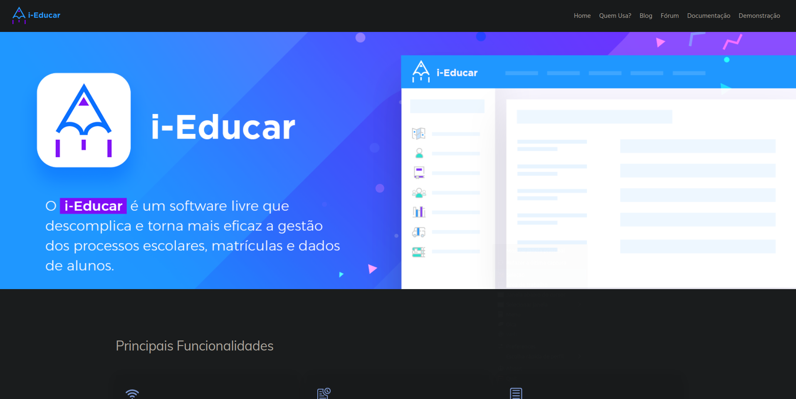
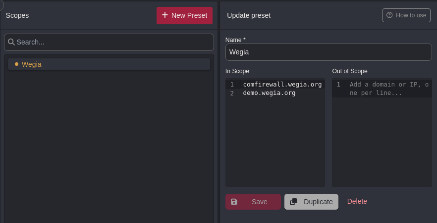
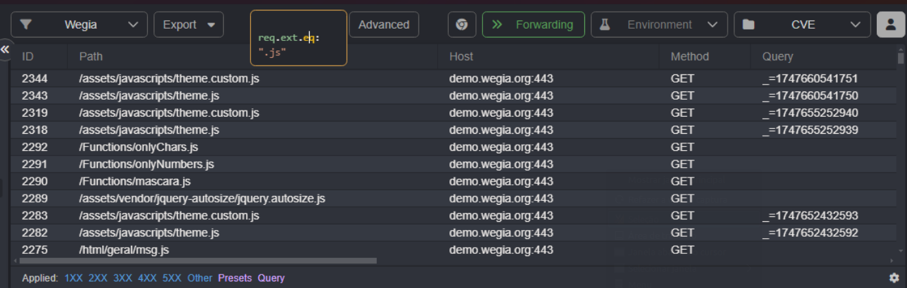

##  Contributions from the CVE-Hunters Group using Caido

Information security is a precious assistance to the design, installation, and ongoing updating of computer systems, especially for public, non-profit, or educational use. With cyber attacks and data breaches on the rise, never has it been more critical to improve the open-source project security.

Our group, CVE-Hunters, strives to find, research, and responsibly disclose vulnerabilities (CVEs) in widely used open-source software. We contribute to the global cybersecurity community by reporting CVEs, improving code security, and helping maintainers patch actual world security vulnerabilities before they become available for attack.

By on-job vulnerability research and live penetration testing, our program not only protects critical web applications but also provides hands-on training for the future generation of ethical hackers and cybersecurity experts. We try to foster a culture of active, open, and inclusive cybersecurity—allowing students and researchers to utilize state-of-the-art tools like Caido to perform simulated attacks, automate security testing, and facilitate secure development practices.

## Project Objectives

Our cybersecurity research is bounded by three core pillars underpinning technical excellence and societal responsibility:

  <ul>
    <li>Bolstering the security of commonly used open-source software with the discovery, verification, and support for remediation of real-world vulnerabilities. These core bugs—be they Cross-Site Scripting (XSS), Insecure Direct Object References (IDOR), or faulty authentication—may be exploited in production, exposing sensitive information.</li>
    <li>Offering experiential cybersecurity training to future professionals through real-world vulnerability assessment projects. Students gain hands-on experience in bug discovery, secure code analysis, and ethical vulnerability disclosure using modern security testing tools like Caido, Burp Suite, and custom automation scripts.</li>
    <li>Encouraging collaborative research and responsible CVE publication of Common Vulnerabilities and Exposures to facilitate awareness of developing threats, improve transparency, and assist with the continuous hardening of critical systems.</li>
  </ul>

## Case 1: WeGIA Platform

One of the main targets of our security research was the WeGIA (Web Manager for Assistance Institutions) web application — an open-source web application to manage third-sector institutions in Brazil, including NGOs, social shelters, and nonprofit institutions. Such organizations are highly reliant on donations, volunteer support, and secure processing of data to function effectively.

The security weaknesses that were discovered were among them critical ones such as unauthorized access, inadequate authentication processes, and data exposure vulnerabilities with considerable impact on confidentiality, integrity, and availability of sensitive information. In a fascinating collaborative pen testing challenge, CVE-Hunters community discovered, responsibly disclosed, and retried 48 security vulnerabilities (CVEs) in the WeGIA system. 

Effective remediation and discovery of the security weaknesses made up the overall security status of the platform and facilitated long-term sustainability and trustiness of the software. This instance supports the necessity for constant vulnerability scanning and ethical hacking presence within the defense of open-source tools utilized in socially critical environments.

## Case 2: i-Educar Platform

Continuing our endeavor to promote the cybersecurity of critical digital infrastructure, our research team directed its focus on the i-Educar platform, a widely used open-source school management platform adopted by numerous public schools and institutions of learning in Brazil.

i-Educar is designed to handle sensitive student data, including students' personal information, teachers' personal information, and learning histories. Thus, the platform becomes a premium target for any potential attackers and thus emphasizes the importance of securing it against future threats.

During a professional application security audit, our team of researchers found other vulnerabilities in the i-Educar system. These included some authentication bypass, insecure exposure of data, and access controls that were improper in nature—both of which can potentially compromise educational information's confidentiality, integrity, and availability.

To date, 3 of the vulnerabilities have been officially assigned CVE IDs and responsibly disclosed to the project maintainers following best practices for coordinated disclosure. The remaining findings are awaiting technical validation and documentation and will be submitted for CVE publication in the coming weeks.

This case study illustrates the importance of vulnerability research to the education community, especially when dealing with open-source platforms which have been storing personally identifiable information (PII). Securing i-Educar, we are committed to making it easier for a secure online community for schools and students.

## Support Tool: Caido

In our thorough web app security testing, Caido has been one of our go-to tools to discover, exploit, and document vulnerabilities. Created for pen testers, security researchers, and bug bounty hunters in mind, Caido is a contemporary and lightweight alternative to Burp Suite that provides a user-friendly interface without any loss of features.

With functionalities tailored to ethical hacking and web application penetration testing, Caido enables efficient workflows in both manual and semi-automated testing environments. Caido's ability to intercept traffic, map the structure of sites, and manage enormous volumes of HTTP requests qualifies it to identify issues like XSS, CSRF, IDOR, authentication flaws, and insecure session ID management.

Apart from its clean UI and smoothness, Caido's design is scalable—making it part of the best tools for security practitioners to look for an enterprise-level web vulnerability scanner and exploit tool in real-world engagements. Be it doing OWASP Top 10 testing or technical deep auditing, Caido is an integral component of an offensive security toolkit in the modern world.

### *Simple and functional interface*

Caido has a minimal, modern, and user-friendly interface designed to ease the web application penetration testing process. Useful features such as a dynamic site map, full browsing history, and real-time interception of HTTP traffic allow security researchers to gain extensive visibility into the structure and operation of the targeted application.

These allow for faster and more precise identification of potential attack vectors, making Caido the solution of choice among professionals looking for an easy-to-use yet powerful platform for real-time request exploration, parameter inspection, and vulnerability detection. From endpoint mapping complex endpoints to analyzing live sessions, Caido optimizes the process without compromising depth or precision.

### *Automation with "Automate"*

The "Automate" feature of Caido allows security professionals to configure and execute customized vulnerability scans with precision and velocity. It is specifically helpful in automating the detection of common web application vulnerabilities such as Cross-Site Scripting (XSS), Cross-Site Request Forgery (CSRF), Insecure Direct Object References (IDOR), and authentication or session management issues.

In supporting scripted test automation and payload injection for tailor-made payloads, Caido's Automate functionality slashes manual labor significantly but boosts precision in identifying security issues in complex web environments. It is an ideal addition for penetration testers and bug bounty hunters alike to enhance their web application security testing using automated, efficient scans tailored to their specific testing scope.

### *Project management*

Caido supports efficient penetration testing procedures through the capability to work on several projects simultaneously without having to restart the application. This kind of functionality is necessary for specialists with several web security tests to execute simultaneously, supporting easy switching between targets without jeopardizing information integrity.

To make pentest campaign management even simpler, Caido has a full-featured Scopes feature. With it, users can effectively define, segment, and manage multiple testing scopes within one project. This proves useful to segment tests in terms of different domains, apps, or environments — improving organization, reducing noise, and supporting targeted vulnerability analysis.

By combining multi-project capability with scope-limited testing via environments, Caido keeps penetration testers, bug bounty hunters, and security researchers productive, effective, and concentrated on the most important bugs.

### *Filters with HTTPQL*

The Caido HTTPQL search engine provides for precise filtering and thorough examination of HTTP requests, even for heavy web traffic. As a security researcher and penetration tester, this concise and straightforward query language assists you in quickly navigating colossal sets of data without being an expert programmer.

With HTTPQL, advanced request filtering is made simpler to implement, and this accelerates the identification of security flaws such as injection points, authentication errors, and session irregularities, which makes it an essential utility for automated web traffic auditing and mass-scale vulnerability testing.

Caido also takes the lead in delivering cutting-edge features that make it stronger in real-world penetration testing and security auditing scenarios:

  <ul>
    <li><b>Invisible proxy:</b> Conveniently captures and saves client and device network traffic that isn't supported by manual proxy configuration. This is especially helpful when testing embedded software, IoT devices, mobile apps, and blocked browsers for deep security analysis in otherwise hard-to-test cases.</li>
    <li><b>DNS override:</b> Provides fine-grained control of domain name resolution during security testing to enable pentesters to spoof DNS, redirect traffic, and create realistic test cases. It is necessary to verify DNS-related vulnerabilities, perform phishing attacks, and analyze complex network attack vectors.</li>
    <li><b>Browser integration:</b> Facilitates instantaneous inspection and dynamic inspection of HTTP/HTTPS traffic from modern web browsers, including those with strong reliance on JavaScript and dynamic content loading. The integration improves the efficiency of testing highly interactive web applications, single-page applications (SPA), and rich-client environments, which permit cross-site scripting (XSS), authentication problems, and other client-side attack detection.</li>
  </ul>

## About the CVE-Hunters Group: Formation, Evolution and Mission

CVE-Hunters is a dedicated information security research group specializing in the discovery, analysis, and responsible disclosure of vulnerabilities in critical software applications. Founded in December 2024 by cybersecurity expert Professor <a href="https://www.linkedin.com/in/nmmorette" >Natan Morette</a>, the group started with just four passionate students eager to deepen their knowledge in offensive security and ethical hacking.

Under the expert technical and ethical mentorship of Professor <a href="https://www.linkedin.com/in/nmmorette">Natan</a>, CVE-Hunters has steadily grown and matured. Today, we proudly count 10 active cybersecurity researchers who apply practical skills learned in both academic settings and hands-on lab environments. Our core focus areas include penetration testing, vulnerability assessment, CVE publication, and contributing to the security hardening of impactful open-source projects with significant social relevance.

Our research and development work is continuously evolving. We are actively analyzing new security flaws, documenting technical details, and preparing additional responsible vulnerability disclosures to the community.

To learn more about our team members, explore our ongoing projects, and follow the latest CVE publications, visit our official GitHub repository at: <a href="https://github.com/Sec-Dojo-Cyber-House/cve-hunters">https://github.com/Sec-Dojo-Cyber-House/cve-hunters</a>.

All identified vulnerabilities and officially published CVEs by CVE-Hunters are transparently catalogued and accessible on our official website: <a href="https://sec-dojo-cyber-house.github.io/">https://sec-dojo-cyber-house.github.io/</a>.

“Security is a journey, not a destination.”  
  

## Written by

 [Elisangela Mendonça](https://www.linkedin.com/in/elisangelasilvademendonca/)

## Contributors

 [Karina Gante](https://www.linkedin.com/in/karina-gante/)

 [Natan Maia Morette](https://www.linkedin.com/in/nmmorette) 

> *By: [CVE-Hunters](https://github.com/Sec-Dojo-Cyber-House/cve-hunters)*